# Brain-Inspired Agent Architecture

## 1. Introduction & Philosophy

Current agent frameworks treat reasoning as a flat pipeline: input → LLM call (maybe with RAG) → tool calls → done. This architecture takes a different approach, modeling the agent after the biological brain's computational structure.

The core insight is that the brain separates **what's relevant** (cortical activation) from **what to do about it** (prefrontal reasoning), and uses distinct subsystems for storage, retrieval, reasoning, evaluation, and consolidation. By making these separations explicit, we get an agent that:

- Retrieves context through **graph structure**, not just embedding similarity
- Reasons in an **explicit loop** with structured state, not a single LLM call
- **Evaluates its own reasoning** through a separate observer, including prediction error
- Maintains a **memory hierarchy** (working memory → scratch space → long-term graph)
- **Consolidates knowledge** asynchronously, like the brain does during sleep

### Core Principle: Reactive Learning

All learning in this system is reactive. The system learns by acting, receiving feedback, and consolidating what worked and what didn't — not by predicting outcomes in advance. This is not a limitation; it's the fundamental mechanism. If we could reliably predict success without acting, we wouldn't need to learn. The value of this architecture is in how quickly it turns failure into useful knowledge through the prediction error → evaluator signal → Dreamer consolidation pipeline.

### Intended Use Pattern: Asynchronous Task Execution

This is an agent that receives tasks and works on them asynchronously, potentially using other AI tools (coding agents, search, etc.) as effectors. It is not optimized for real-time chat latency — the value is in depth of understanding and quality of reasoning, not response speed. Real-time chat could be built as a simplified fast-path, but the core architecture is designed for autonomous task execution with rich reasoning.

### Brain ↔ System Mapping

| Brain Structure | System Component | Role |
|----------------|-----------------|------|
| Sensory Cortex (exteroceptive) | Exteroceptive Sensors | Input processing (passive: external stimuli; active: PFC-directed investigation) |
| Interoceptive System (insular cortex, SCN, place cells) | Interoceptive Sensors | Ambient self-state: temporal awareness, spatial grounding, identity context |
| Cortex (long-term synaptic structure) | Knowledge Graph | Permanent knowledge storage |
| Hippocampus | Graph Activation / Retrieval | Index, compress, decompress, re-activate |
| Prefrontal Cortex (PFC) | PFC Loop | Recurrent reasoning with structured state |
| Basal Ganglia + Dopamine | Evaluator | Gating, quality signal, prediction error |
| Motor Cortex | Effectors (respond, sense, act) | Intent-level output actions (communicate, perceive, change) |
| Anterior Cingulate Cortex (ACC) | Activation Metadata + Complexity Estimation | Conflict monitoring, effort estimation |
| Hippocampal short-term index | Scratch Space | Session-scoped intermediate storage |
| Sleep consolidation | Dreamer | Async knowledge consolidation |
| Neural manifold geometry | Embedding Strategy | Geometry-matched compression per data type |

---

## 2. Architecture Overview

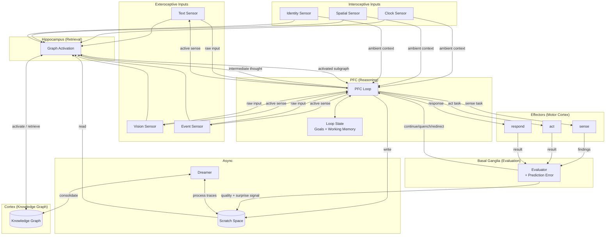

---

## 3. Sensors

**Brain analog: Sensory Cortex + Interoceptive System** — the brain has two broad categories of sensing. *Exteroceptive* senses (visual cortex, auditory cortex, etc.) receive raw stimuli from the outside world, extract structured features, and project those features into cortical association areas. *Interoceptive* senses (insular cortex, suprachiasmatic nucleus, hippocampal place cells) monitor the body's own state — time, position, physiological condition — providing ambient context that colors all downstream reasoning. In both cases, the sensory system does *not* decide what to do; it prepares input for downstream systems that will.

Sensors are modality-specific input processors. Each sensor accepts a raw stimulus — either external (a chat message, an image, a webhook payload) or internal (the current time, the working directory, user identity) — and normalizes it into a `SensorOutput` — a structured representation containing extracted entities, embeddings, and metadata. Critically, **sensors are additive annotators, not filters**. The raw input always passes through to the PFC Loop alongside the activated subgraph — sensor processing *enriches* the input with structured annotations, but never replaces it. The PFC always sees the original message, image, or event payload.

This is more biologically accurate: when you see an apple, your visual cortex doesn't throw away the raw image and hand the prefrontal cortex a label. The raw percept persists in conscious experience while activated concepts (color, shape, "fruit", memories of apples) enrich understanding in parallel.

This design also solves the **cold start problem**. If the knowledge graph is empty and graph activation returns nothing, the PFC still has the raw input to work with. It degrades gracefully instead of failing — like a new employee reading a ticket with no background knowledge. They can still reason about it, even without prior context.

A sensor's job is to extract enough structure from raw input to enable meaningful graph activation. For text, that means entity extraction and embedding generation. For vision, that means scene description, object detection, and embedding. For events, that means parsing the event schema into typed entities and urgency signals.

```typescript
/** A single entity extracted from raw input. */
interface ExtractedEntity {
  name: string;
  type: string;             // e.g. "person", "tool", "concept", "file"
  confidence: number;       // 0–1
  span?: { start: number; end: number }; // position in raw input, if applicable
}

/** The normalized output every sensor must produce. */
interface SensorOutput {
  modality: string;         // "text" | "vision" | "event" | custom
  timestamp: number;
  raw: unknown;             // original input — first-class PFC input, not just traceability
  entities: ExtractedEntity[];
  embedding: number[];      // dense vector for similarity-based activation
  metadata: Record<string, unknown>; // modality-specific extras
  urgency: number;          // 0–1, hint for activation priority
}

/** The contract every sensor implements. */
interface Sensor<TInput = unknown> {
  modality: string;
  /** Process raw input into a normalized SensorOutput. */
  process(input: TInput): Promise<SensorOutput>;
  /** Whether this sensor can handle the given input. */
  canHandle(input: unknown): boolean;
}
```

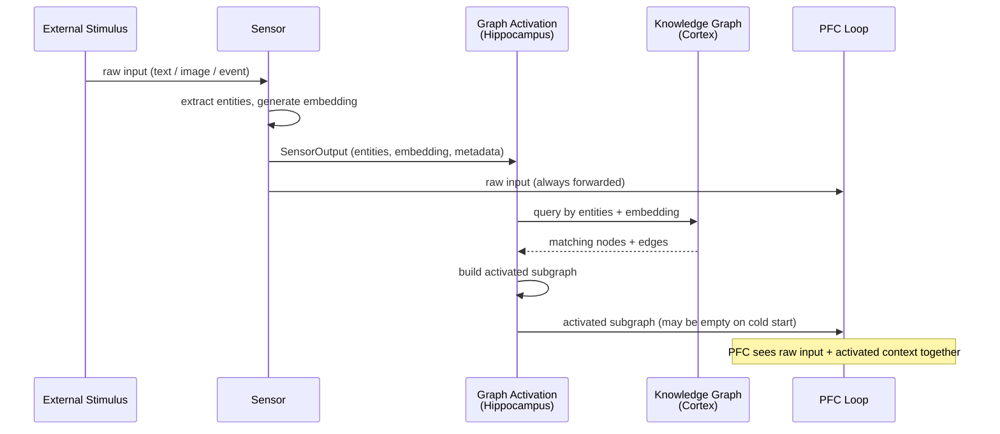

### 3.1 Active Sensing

**Brain analog: Directed attention / active perception** — when you decide "I need to understand this codebase," your PFC directs your sensory systems to go look. Your visual cortex does the heavy lifting of reading; the PFC gets back structured understanding, not raw pixels.

The sensor model described above is **passive**: external input arrives, the sensor extracts structure, and the PFC reasons over it. But the PFC also needs to **actively sense** — to direct the sensor system to investigate a source (a repo, a URL, a document, a database) and return structured findings. This gives the system two modes of sensing:

1. **Passive sensing** (Section 3 above): External stimulus arrives → Sensor extracts entities + embedding → feeds Graph Activation and PFC.
2. **Active sensing**: The PFC Loop emits an action saying "go investigate this source." A research process spins up, investigates, and returns structured findings that feed back through the sensor pathway.

Active sensing is an **effector** — the PFC triggers it as an action with a `SensePayload` — but its output feeds back through the **sensor pathway**. The research process produces `SenseFindings`: structured entities, observations, edges, and a summary that look like enriched `SensorOutput`.

The research process is **not** another PFC loop. It is simpler: an LLM with internal tools (readFile, bash — whatever the source requires) that investigates and extracts. No goal stack, no evaluator, no working memory management. It is a tool, not an agent. These internal tools (readFile, bash) are not visible to the PFC — they are implementation details of the sense effector, just as individual muscle contractions are implementation details of the motor cortex's goal-directed movements.

Critically, the investigation strategy is **not hard-coded**. There are no "if directory do X, if URL do Y" decision trees. The LLM decides how to explore (ls, grep, read files, fetch URLs, run queries) based on the source and task. The only fixed part is the **output format**:

```typescript
/** What the PFC sends when it triggers active sensing. */
interface SensePayload {
  task: string;      // what to investigate
  source: string;    // path, URL, or other source identifier
  hints?: string[];  // optional search terms to guide investigation
}

/** What the research process returns. */
interface SenseFindings {
  summary: string;
  entities: { name: string; type: string; observations: string[] }[];
  edges: { source: string; target: string; relation: string }[];
}
```

**Output routing:** The structured observations from `SenseFindings` go through the **Evaluator** like any other effector action. The Evaluator assesses whether the findings are useful for the current goal and annotates them with quality/surprise signals. This ensures the Dreamer gets proper annotations for consolidation. The prediction is lighter than for act calls — the PFC predicts whether the investigation will yield useful information, not the specific content. After evaluation, the annotated findings are written to **scratch space** (for eventual Dreamer consolidation into the graph). The PFC receives the compressed `summary` in working memory — enough to reason about without the raw source material.

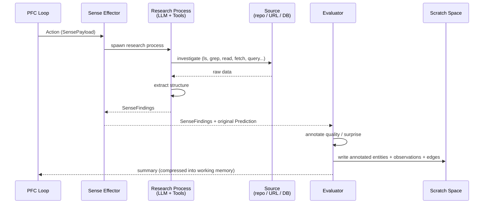

### 3.2 Interoceptive Sensors

**Brain analog: Interoceptive system** — the brain doesn't just process external stimuli. It continuously monitors its own state through interoceptive pathways: the suprachiasmatic nucleus tracks time (circadian rhythms), hippocampal place cells and grid cells encode spatial position ("where am I"), and the insular cortex integrates visceral signals into a felt sense of the body's current condition. These signals are always on — the PFC has access to them without requesting them, and they color every decision without being explicitly queried.

The agent has no body, but it has analogous self-state that shapes reasoning:

- **Temporal awareness** — what time is it? When was the session started? This affects urgency, scheduling, and reasoning about recency.
- **Spatial grounding** — where is the agent operating? The working directory, the project context, the repository. This is the closest analog to place cells — it tells the PFC "where it is" in a workspace.
- **Identity context** — who is the agent working for? What role does it have? This shapes tone, assumptions, and the level of explanation appropriate for the user.

Interoceptive sensors use the **same `Sensor` interface** as exteroceptive sensors. They produce `SensorOutput` with entities, embeddings, and metadata. The difference is in richness, not in kind. Fields like `urgency` and `span` are typically zero/absent for interoceptive sensors — a timestamp has no urgency priority and no position in a raw input stream. The `modality` field works naturally (e.g., `"temporal"`, `"spatial"`, `"identity"`).

| Interoceptive sense | Entities | Embedding | Graph activation value |
|---|---|---|---|
| Clock / temporal | Minimal or empty | None | Low — time rarely seeds useful graph lookups |
| Spatial / project | Yes — project name, org, context | Yes — project description embedding | High — activates everything the graph knows about this context |
| Identity / user | Yes — user name, role | Possibly | Medium — could activate user preferences, working patterns |

Some interoceptive sensors are degenerate — a clock sensor produces `{entities: [], embedding: [], raw: 1711929600000}`. This is fine. The raw value reaches the PFC through `LoopState.sensorOutputs`, and the empty entities/embedding simply mean it contributes no graph activation seeds. Other interoceptive sensors are rich — a spatial sensor that parses the working directory into project entities and generates an embedding for the project description will activate relevant graph context, pulling in everything the system knows about this project before the PFC even starts reasoning.

The key insight: **there is no architectural boundary between exteroceptive and interoceptive sensing.** They share the same interface, feed into the same graph activation pipeline, and land in the same `LoopState`. The distinction is conceptual — where the sensor points (outward vs. inward) — not structural. This means the system doesn't need a separate "environment" component. What would otherwise be ad-hoc environment configuration (working directory, timestamps, user identity) becomes properly modeled input that participates in graph activation and gets the same treatment as any other sensory data.

**When interoceptive sensors fire:** Unlike exteroceptive sensors (which fire in response to external events), interoceptive sensors fire at the **start of every loop initialization**. They provide the ambient context that the PFC always has access to. This mirrors biology — you don't "request" awareness of what time it is or where you are. It's just there.

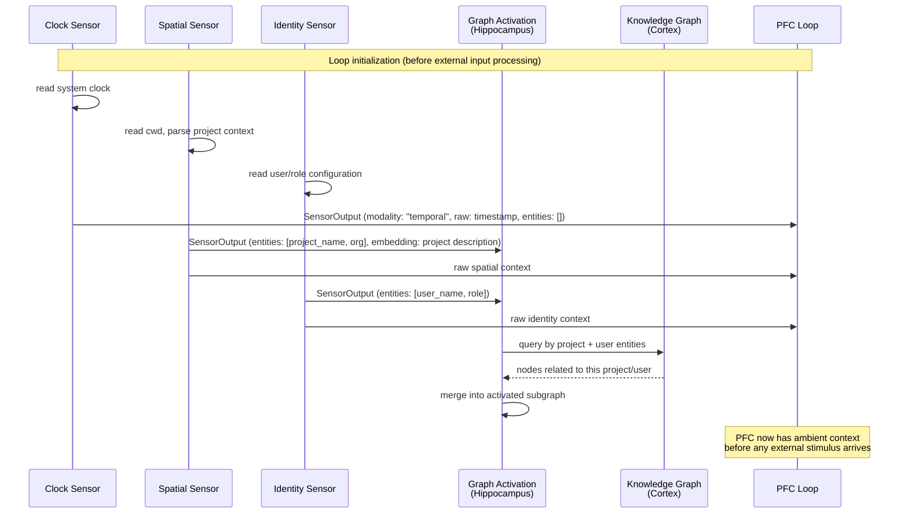

---


## 4. Knowledge Graph & Graph Activation

### 4.1 Concepts

**Knowledge Graph (Cortex)** — The brain's cortex encodes long-term knowledge in synaptic structure: billions of neurons connected by weighted edges, where each neuron participates in many overlapping representations. The Knowledge Graph mirrors this. Entities are nodes; relationships are edges; and fine-grained facts about an entity are stored as individually addressable **observations**, each carrying its own embedding vector. This observation-level granularity is critical — retrieval targets individual facts, not monolithic entity descriptions, just as cortical recall activates specific synaptic pathways, not entire brain regions.

**Graph Activation (Hippocampus)** — The hippocampus acts as an index into cortical memory. It doesn't store knowledge long-term — it rapidly binds disparate cortical representations into coherent episodes and replays them on demand. Graph Activation does the same: given a query (from a sensor, or from an intermediate PFC thought *when reactivation is triggered* — see 5.5), it finds seed nodes via vector search on observation embeddings, then **spreads activation** outward through edges with decay. The result is an activated subgraph — a coherent, structurally-connected slice of the graph that becomes the PFC Loop's working context. This is strictly better than flat RAG because graph edges encode relationships that embedding similarity alone cannot capture.

### 4.2 Data Model

```typescript
/** A single fact or description about an entity. Individually embeddable, individually retrievable. */
interface Observation {
  id: string;
  content: string;
  embedding: Float32Array;
  confidence: number;         // 0–1, decays or strengthens over time
  source: ObservationSource;
  createdAt: number;          // unix ms
  lastActivatedAt: number;    // unix ms — recency weighting uses this
  supersededBy?: string;      // observation id, set by Dreamer during consolidation
}

interface ObservationSource {
  type: "sensor" | "pfc_inference" | "dreamer_consolidation" | "external";
  sessionId?: string;
  sensorId?: string;
}

/** A node in the knowledge graph. Represents any entity worth modeling. */
interface GraphNode {
  id: string;
  name: string;
  type: string;               // "person" | "concept" | "object" | "event" | ... open-ended
  metadata: Record<string, unknown>;
  observations: Observation[];
  createdAt: number;
  lastActivatedAt: number;
}

/** A connection between two nodes. Loosely typed — no fixed ontology. */
interface Edge {
  id: string;
  sourceNodeId: string;
  targetNodeId: string;
  relation?: string;          // optional label: "produced", "mentioned_with", "caused", etc.
  weight: number;             // 0–1, influences activation spread
  createdAt: number;
  metadata?: Record<string, unknown>;
}

/** The result of graph activation — a coherent slice of the graph ready for the PFC Loop. */
interface ActivatedSubgraph {
  nodes: ActivatedNode[];
  edges: Edge[];              // only edges connecting nodes in this subgraph
  seedNodeIds: string[];      // which nodes were the initial vector-search hits
  activationScores: Map<string, number>; // nodeId → activation strength (0–1)

  // --- Activation metadata (computed from graph structure, not LLM) ---
  contextDensity: number;     // observations per query keyword (high = rich context, low = sparse)
  dispersion: number;         // 0–1, how spread out activated nodes are across the graph
  coverageGaps: string[];     // query terms that had no graph matches
  clusterCount: number;       // number of distinct node clusters in the activation

  // --- Multi-perspective activation (present when dispersion is high) ---
  perspectives?: Perspective[];
}

/** A labeled subset of the activated subgraph representing one coherent "lens" on the query.
 *  Perspectives emerge from graph topology — they are NOT hard-coded categories. */
interface Perspective {
  label: string;              // auto-generated from the cluster's dominant node types/relations
  nodes: ActivatedNode[];
  edges: Edge[];              // edges within this perspective's cluster
  anchorNodeIds: string[];    // the most central nodes in this cluster
  coherence: number;          // 0–1, how tightly connected this cluster is internally
}

/** A node in the activated subgraph, carrying only its relevant observations. */
interface ActivatedNode {
  node: GraphNode;
  relevantObservations: Observation[]; // subset — not every observation, only those that matched or are high-confidence
  activationScore: number;            // how strongly this node was activated
  hopsFromSeed: number;               // 0 = seed node, 1 = one hop out, etc.
}
```

### 4.3 Graph Activation Service

```typescript
interface ActivationQuery {
  text: string;                        // the raw query (sensor input or PFC thought)
  embedding: Float32Array;             // pre-computed embedding of the query
  source: "sensor" | "pfc_explicit" | "evaluator_surprise" | "drift";
  sessionId?: string;
}

interface ActivationConfig {
  seedLimit: number;                   // max seed nodes from vector search (default: 10)
  spreadHops: number;                  // how many hops to spread (default: 2)
  decayFactor: number;                 // activation decays by this per hop (default: 0.5)
  minActivationThreshold: number;      // prune nodes below this score (default: 0.1)
  recencyWeight: number;               // how much lastActivatedAt affects ranking (default: 0.2)
  maxObservationsPerNode: number;      // cap relevant observations returned (default: 5)
}

interface GraphActivationService {
  /**
   * Core activation: query → activated subgraph.
   * Used identically for sensor input and PFC re-activation.
   */
  activate(query: ActivationQuery, config?: Partial<ActivationConfig>): Promise<ActivatedSubgraph>;

  /** Vector search on observation embeddings. Returns seed nodes ranked by similarity. */
  findSeeds(embedding: Float32Array, limit: number): Promise<ActivatedNode[]>;

  /** Spread activation outward from seed nodes through edges with decay. */
  spreadActivation(seeds: ActivatedNode[], hops: number, decay: number): Promise<ActivatedSubgraph>;

  /** Write-side: create or update nodes, observations, and edges. */
  upsertNode(node: Partial<GraphNode> & { name: string; type: string }): Promise<GraphNode>;
  addObservation(nodeId: string, observation: Omit<Observation, "id">): Promise<Observation>;
  addEdge(edge: Omit<Edge, "id">): Promise<Edge>;

  /** Touch lastActivatedAt on nodes and observations that were retrieved. */
  recordActivation(subgraph: ActivatedSubgraph): Promise<void>;

  /**
   * Cluster detection + perspective formation on an activated subgraph.
   * Runs when dispersion exceeds a threshold. Identifies distinct node clusters
   * using graph connectivity, labels each cluster from its dominant node types,
   * and returns labeled Perspectives. This is a graph computation, not an LLM call.
   */
  detectPerspectives(subgraph: ActivatedSubgraph): Perspective[];
}
```

### 4.4 Activation Flow

```mermaid
flowchart LR
    Q["Query<br/>(sensor or PFC thought)"] --> EMB["Embed query"]
    EMB --> VS["Vector search<br/>observation embeddings"]
    VS --> SEEDS["Seed nodes<br/>(top-k matches)"]
    SEEDS --> SA["Spread activation<br/>1–2 hops via edges<br/>with decay"]
    SA --> PRUNE["Prune below<br/>activation threshold"]
    PRUNE --> ASG["Activated Subgraph<br/>nodes + observations + edges"]
    ASG --> PFC["→ PFC Loop context"]

    style Q fill:#e8d5f5,stroke:#7b2d8e
    style SEEDS fill:#d5e8f5,stroke:#2d5f8e
    style ASG fill:#d5f5e0,stroke:#2d8e4a
    style PFC fill:#f5f0d5,stroke:#8e7b2d
```

**Activation algorithm:** Seed nodes receive activation score = their vector similarity to the query. At each hop, a neighbor's activation = `max(incoming activations) * edge.weight * decayFactor`. Nodes reached from multiple paths take the maximum incoming activation (not the sum — this prevents runaway amplification). Nodes below `minActivationThreshold` are pruned from the result.

The key property: **the hippocampus is source-agnostic**. Whether the query comes from a text sensor processing user input or from the PFC Loop generating an intermediate thought, the activation mechanism is identical. This means the PFC can "think about" something and pull in new context mid-reasoning, exactly as the biological hippocampus supports both perception-driven and thought-driven recall.

### 4.5 Multi-Perspective Activation & Complexity Estimation

**Brain analog: Anterior Cingulate Cortex (ACC) conflict monitoring + cortical perspective-taking.** The ACC monitors conflict between competing processing streams and estimates the cognitive effort a task requires. When multiple brain regions activate in response to a stimulus but disagree, the ACC signals that effortful control is needed. This section describes the architectural equivalent: detecting when an activation maps to multiple distinct areas of the graph, forming those into labeled perspectives, and using the activation metadata to estimate task complexity.

**Why this matters:** A flat subgraph treats all activated nodes as a single context. But when the query "make the dashboard better" activates nodes about performance, UX, AND data accuracy, those are distinct frames that may lead to different conclusions. The PFC needs to know that, not discover it by accident mid-reasoning.

#### Activation Metadata

The metadata fields on `ActivatedSubgraph` (`contextDensity`, `dispersion`, `coverageGaps`, `clusterCount`) are computed directly from graph structure after activation completes. No LLM call is involved.

- **contextDensity** = total relevant observations / number of query keywords. High density means the graph is rich in this area. Low density means the system has limited knowledge.
- **dispersion** = measures how far apart activated nodes are in graph distance. Computed from the average shortest path between activated node pairs, normalized to 0-1. Low dispersion (nodes form one tight cluster) = the query maps to a single coherent topic. High dispersion (nodes spread across distant graph regions) = the query touches multiple distinct areas.
- **coverageGaps** = query terms that produced no seed nodes during vector search. These are blind spots in the graph.
- **clusterCount** = number of connected components (or dense subgroups) within the activated subgraph, detected via standard graph clustering on the activated edges.

#### Multi-Perspective Formation

When `dispersion` exceeds a configurable threshold, `detectPerspectives()` runs on the activated subgraph. It identifies distinct node clusters and returns each as a labeled `Perspective`. The labels are auto-generated from the dominant node types and relation labels within each cluster — they are NOT hard-coded categories like "user lens" or "technical lens."

Perspectives **emerge from the graph structure**. A sparse graph produces few (or zero) perspectives. A rich, well-connected graph produces many. As the system learns and the knowledge graph grows, multi-perspective reasoning develops naturally.

Example — query: "make the dashboard better"
- **Perspective A** (cluster around performance nodes): observations about load times, bundle size, API latency
- **Perspective B** (cluster around UX nodes): observations about layout complaints, accessibility gaps, user feedback
- **Perspective C** (cluster around data nodes): observations about metric accuracy, missing data sources

The PFC uses **convergence** across perspectives (all lenses agree on an approach) as a high-confidence signal, and **divergence** (lenses point in different directions) as ambiguity requiring clarification or tradeoff navigation.

#### Complexity Estimation (ACC Analog)

Complexity estimation is a lightweight computation on the activation metadata. It determines how the PFC loop should approach the task — NOT what the answer is.

| Activation Pattern | Complexity | PFC Approach |
|---|---|---|
| Single tight cluster, low dispersion | Simple | Single perspective, direct reasoning |
| Multiple distinct clusters, high dispersion | Complex | Multi-perspective reasoning, tradeoff navigation |
| Low context density, many coverage gaps | Insufficient knowledge | Flag for clarification or exploratory activation |

This is a graph computation, not an LLM call. It runs before the PFC loop begins its first iteration, shaping the initial loop state.

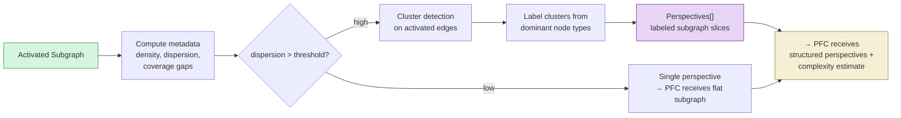

### 4.6 Embedding Geometry & Future Directions

The current architecture uses standard Euclidean embeddings (e.g., 1536-dim vectors with cosine similarity) for all observations. This is a practical starting point, but research on the brain's native coordinate system suggests it's a simplification. Different types of information compress into different geometric spaces. **Hierarchical relationships** (dependency chains, taxonomies, organizational structures) embed with dramatically less distortion in **hyperbolic space** — Nickel & Kiela (2017) showed 5D Poincare embeddings outperformed 200D Euclidean embeddings on hierarchical data, a 40x dimensionality reduction. **Relational/periodic patterns** (deployment cycles, recurring incident patterns, temporal rhythms) map naturally to **toroidal geometry**, as confirmed by grid cell research (Gardner et al., 2022). **Factual observations** (descriptions, measurements, specific events) are approximately Euclidean. This maps to the **product manifold hypothesis**: M ≈ T^k × H^d × R^n (toroidal × hyperbolic × Euclidean). See `mem_geometry_report.md` for the full research.

The architectural implication is that the `GraphActivationService` already abstracts embedding and similarity computation behind interfaces. This means the system can start with flat Euclidean embeddings and later introduce geometry-aware embeddings (e.g., hyperbolic distance for hierarchical edges, cosine similarity for factual observations) without changing the rest of the architecture. The `Observation` interface could later gain a `geometryHint` field to tag the type of structure being encoded.

**Storage note:** libSQL is the recommended backing store for the knowledge graph and embeddings — it supports vector similarity natively while keeping the single-binary deployment story simple. See `graphdbresearch.md` for the full evaluation.

---

## 5. PFC Loop & Loop State

**Brain analog: Prefrontal Cortex (PFC) recurrent circuits** — the PFC doesn't fire once and produce an answer. It sustains activity across recurrent loops, holding goals in anterior regions while posterior regions work through sub-tasks. Each cycle refines the representation until the basal ganglia gates the output — "good enough, act on it" or "not done, keep going." Working memory is bounded by a token budget (a percentage of the LLM context window), and sustained activity fatigues over time.

The PFC Loop is the core reasoning engine. It is **not** a flat ReAct tool-call loop. It is a recurrent reasoning loop with structured, evolving state. Each iteration receives the full loop state — goals, activated context, working memory, iteration count — and produces either an internal **Thought** (which re-enters Graph Activation for fresh context retrieval) or an external **Action** paired with a **Prediction** (which goes to an Effector). The loop continues until the Evaluator quenches it, fatigue hits, or state stops changing.

### 5.1 Goal Stack

Goals form a **hierarchy** (a tree with stack-like push/pop behavior at the leaf level). The outermost goal is the most abstract intent; inner goals are progressively more tactical sub-tasks. This mirrors how the anterior PFC holds abstract goals ("cook pasta") while posterior PFC holds immediate sub-goals ("turn the knob to ignite the burner"). When a sub-goal completes, it pops off the stack and the outer goal selects the next sub-goal. The outer goal is **never suspended** — it persists across all inner iterations, providing continuity.

### 5.2 Working Memory

Working Memory holds recent intermediate thoughts, bounded by a token budget rather than a fixed chunk count. The LoopState receives a total token budget (a configurable percentage of the LLM context window), and space within that budget is dynamically allocated across activated context, working memory thoughts, the goal stack, raw sensor input, and the last effector result. When the working memory portion approaches its allocated budget, a compression step fires: older thoughts get summarized/compressed rather than evicted, preserving their information at reduced fidelity while keeping recent thoughts at full resolution. This means capacity is fluid — a few long, detailed thoughts consume more budget than many short ones — and no information is silently dropped.

### 5.3 Activation Metadata & Multi-Perspective Reasoning

The `ActivatedSubgraph` in `LoopState.activatedContext` carries metadata (see 4.5): `dispersion`, `contextDensity`, `coverageGaps`, `clusterCount`, and optionally `perspectives`. The PFC uses these signals to modulate its reasoning:

- **High dispersion / multiple perspectives:** The task is multi-faceted. The PFC should reason across perspectives, noting where they converge (high confidence) and diverge (ambiguity or tradeoffs). Convergence drives action; divergence may warrant clarification or explicit tradeoff decisions.
- **Low context density / many coverage gaps:** The graph has little relevant knowledge. The PFC should consider requesting clarification rather than acting on speculation.
- **Single tight cluster:** The task is well-understood. The PFC can proceed with standard goal decomposition.

These signals are available in the LLM prompt as structured metadata alongside the activated nodes. The PFC doesn't need special logic — a well-prompted LLM will naturally adjust its reasoning when told "activation dispersion is high across 4 clusters" vs. "activation is concentrated in 1 cluster."

### 5.4 The Recurrent Cycle

Each iteration follows one of two paths:

1. **Thought path (internal):** PFC produces a Thought -> Thought updates working memory. **Most thoughts do NOT trigger reactivation.** The PFC keeps working with its existing activated context. Reactivation through Graph Activation only fires when a specific trigger is met (see 5.5 Reactivation Policy). This is critical for performance — a typical sequence of sense/act calls runs with zero reactivation overhead.
2. **Action path (external):** PFC produces an Action + Prediction -> Effector executes -> result + prediction error return -> Evaluator judges -> loop state updates. If the Evaluator produces a high surprise signal, it may trigger reactivation (see 5.5). For sense actions, the structured findings are written to scratch space and a compressed summary is pushed to working memory, allowing the PFC to reason about the findings without the raw source material.

```typescript
/** A single goal in the hierarchical goal stack. */
interface Goal {
  id: string;
  description: string;
  depth: number;              // 0 = outermost (most abstract), higher = more tactical
  status: "active" | "completed" | "blocked" | "abandoned";
  parentId?: string;          // links to the enclosing goal
  completionCriteria: string; // what "done" looks like for this goal
}

/** An internal reasoning step — does NOT leave the system. */
interface Thought {
  kind: "thought";
  content: string;            // the reasoning content
  timestamp: number;
  /** Entities/queries to re-activate through Graph Activation.
   *  Empty array = no reactivation triggered by this thought.
   *  Only thoughts with non-empty hints trigger explicit PFC-requested reactivation. */
  reactivationHints: string[];
}

/** An external action — leaves the system via an Effector. */
interface Action {
  kind: "action";
  effectorId: string;         // which effector to invoke
  payload: unknown;           // action-specific parameters
  prediction: Prediction;     // forward-model prediction (efference copy)
  timestamp: number;
}

/** The output of a single PFC iteration: either a Thought or an Action. */
type PFCOutput = Thought | Action;

/** The full structured state carried across loop iterations. */
interface LoopState {
  /** Raw sensor outputs — always available, even if graph activation returns nothing (cold start). */
  sensorOutputs: SensorOutput[];
  /** Hierarchical goal stack. Index 0 = outermost abstract goal. */
  goals: Goal[];
  /** The subgraph returned by Graph Activation for this iteration. */
  activatedContext: ActivatedSubgraph;
  /** Token-budget-managed buffer of intermediate thoughts. Recent thoughts at full fidelity, older ones compressed. */
  workingMemory: Thought[];
  /** How many iterations have elapsed. Used for fatigue-based termination. */
  iterationCount: number;
  /** Results from the most recent effector action, if any. */
  lastEffectorResult?: EffectorResult;
  /** The most recent evaluation signal from the Evaluator. */
  lastEvaluation?: EvaluationResult;
}

/** Configuration for the PFC Loop. */
interface PFCLoopConfig {
  maxIterations: number;         // fatigue ceiling
  tokenBudgetPercent: number;    // percentage of context window allocated to LoopState
  compressionThreshold: number;  // fraction of token budget that triggers thought compression
  staleStateThreshold: number;   // consecutive no-change iterations before quenching
}

/** The PFC Loop itself. */
interface PFCLoop {
  config: PFCLoopConfig;
  state: LoopState;

  /** Run one iteration: receive full state, produce a Thought or Action. */
  iterate(state: LoopState): Promise<PFCOutput>;
  /** Push a sub-goal onto the goal stack. */
  pushGoal(goal: Goal): void;
  /** Pop a completed sub-goal and let the parent goal select the next step. */
  popGoal(goalId: string): void;
  /** Add a thought to working memory, compressing older thoughts if token budget is exceeded. */
  updateWorkingMemory(thought: Thought): void;
  /** Run the full loop until termination. */
  run(): Promise<void>;
}
```

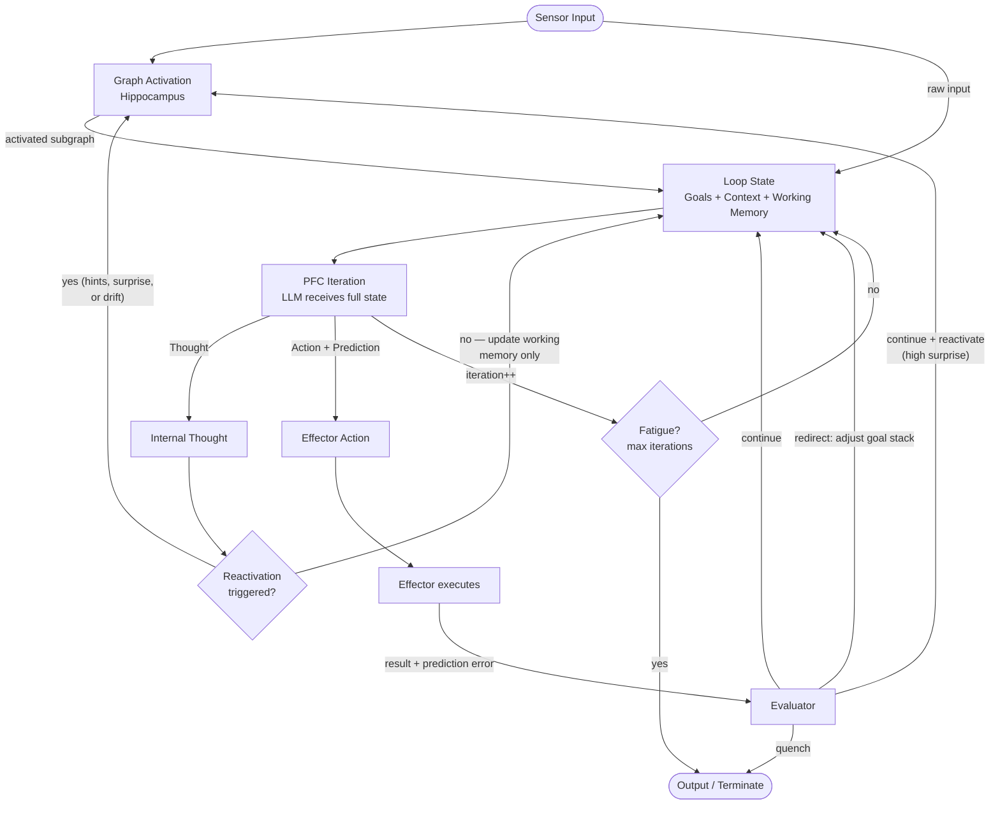

### 5.5 Reactivation Policy

Reactivation — going back through Graph Activation to pull fresh context into working memory — is **signal-driven, not per-iteration.** Most PFC loop iterations do NOT trigger reactivation. A typical tool-call sequence (read file, grep, read another file) runs with no reactivation overhead. The PFC keeps working with what it has.

Three signals can trigger reactivation:

1. **Surprise-driven (reactive):** The Evaluator produces a high surprise signal (from prediction error or unexpected result content). This is the most important trigger. When the surprise level is `"high"` or `"critical"`, the Evaluator provides a `reactivationQuery` describing the surprising information, and the PFC loop feeds that query into Graph Activation. *Example:* The PFC predicted the login page uses AuthService, but the file shows it was migrated to a new framework. High prediction error -> reactivate with "new framework X" to pull in relevant graph context about the migration.

2. **Drift-driven (proactive):** Working memory has drifted far from the original activated context. Measured by cosine similarity between the current working memory state (e.g., embedding of recent thoughts) and the original activation query. When similarity drops below a configurable threshold, reactivation fires with the current working memory state as the query. This is a staleness check, not a timer — it triggers when the reasoning has wandered into territory the original context doesn't cover, regardless of how many iterations have elapsed. *Example:* The user asked about project X's status, but the PFC has followed a chain of blockers into dependency Y's architecture. The original activated context (project X nodes) is stale for this new territory.

3. **Explicit (PFC-requested):** The PFC emits a Thought with non-empty `reactivationHints`. This is the deliberate "reaching for a memory" case — the PFC recognizes it needs context it doesn't currently have and explicitly asks for it. Only Thoughts with non-empty `reactivationHints` trigger this path. *Example:* The PFC is reasoning about a deployment failure and realizes it needs to know the service's dependency graph. It emits a Thought with `reactivationHints: ["service X dependency graph", "downstream consumers of service X"]`.

---

## 6. Evaluator & Prediction Error

**Brain analog: Basal Ganglia + Dopaminergic system** — the PFC does not evaluate itself. The basal ganglia act as a gate on PFC output: thalamo-cortical loops are either allowed through (GO pathway) or suppressed (NO-GO pathway). Dopamine neurons in the VTA/SNc fire a **prediction error signal** — they increase firing when reality is better than expected (positive surprise), decrease when worse (negative surprise), and stay baseline when things go as predicted. This signal is what drives reinforcement learning: high surprise means "pay attention and update your model."

The Evaluator is a **separate component** from the PFC Loop. This separation is non-negotiable. Letting the reasoning system evaluate its own output is the architectural equivalent of letting a student grade their own exam. The Evaluator observes each iteration's output, compares predictions against actual results, and produces signals that control whether the loop continues, redirects, or terminates.

### 6.1 Evaluation Signals

Each evaluation produces three signals:

1. **Completion status** — should the loop continue, stop, or change direction?
2. **Quality signal** — was the last step productive, neutral, or counterproductive? This is the dopamine burst or dip.
3. **Surprise / novelty** — did something unexpected happen? High surprise flags the result for consolidation by the Dreamer. **The surprise signal serves double duty:** it gates consolidation priority AND triggers reactivation. When surprise is `"high"` or `"critical"`, the Evaluator populates a `reactivationQuery` on the `EvaluationResult`, signaling the PFC loop to reactivate with the surprising information as the query (see 5.5 Reactivation Policy). This means the Evaluator doesn't just say "something unexpected happened" — it tells the system *what* was unexpected so the graph can be queried for relevant context.

### 6.2 Prediction Error

Before every effector action, the PFC Loop generates a **Prediction** (the efference copy). When the actual result returns, the Evaluator computes the deviation. This deviation *is* the learning signal:

- **High deviation** = high surprise = prioritize for Dreamer consolidation. The system's world model was wrong; it needs updating.
- **Low deviation** = expected outcome = low signal. Don't waste consolidation effort on what's already well-modeled.
- **Direction matters:** a positive surprise (better than expected) and a negative surprise (worse than expected) both have high deviation but carry different valence for goal management.

### 6.3 Termination: Three Brakes

The brain doesn't have one mechanism for stopping a thought — it has several redundant ones. The Evaluator implements three:

1. **Deliberate stop (basal ganglia gate):** The Evaluator determines the goal is satisfied. Clean termination.
2. **Fatigue (synaptic fatigue):** Max iterations reached. The loop has been running too long — force-stop regardless of goal status.
3. **Stale state (no new information):** Consecutive iterations produce no meaningful state change. The loop is spinning without progress — quench it.

### 6.4 Implementation Note

The Evaluator can be a **smaller, faster model** than the PFC Loop's reasoning LLM. It doesn't need deep reasoning ability — it needs pattern matching: "is this done?", "did the prediction match?", "is this going in circles?" A lightweight model with low latency is preferable, since the Evaluator runs on every iteration.

**Evaluating Thoughts vs. Actions:** When the PFC produces a Thought (not an Action), there is no prediction error to compute. The Evaluator still assesses goal progress, stale-state detection, and whether the thought is productive or circular — but the surprise signal comes only from the thought's content relative to the current goal, not from prediction deviation.

Quality signals and surprise metadata get written to **Scratch Space** as `ConsolidationSignal` records. The Dreamer processes these asynchronously to update the Knowledge Graph — closing the loop between runtime experience and long-term knowledge.

```typescript
/** The Evaluator's judgment of a single PFC iteration. */
interface EvaluationResult {
  /** Should the loop continue, stop, or change course? */
  status: "continue" | "done" | "redirect";
  /** Quality of the last step — the dopamine signal. */
  quality: "productive" | "neutral" | "counterproductive";
  /** How surprising was the result? Drives consolidation priority. */
  surprise: "none" | "low" | "high" | "critical";
  /** If redirecting, what should change in the goal stack? */
  redirectAction?: {
    type: "pop_goal" | "push_goal" | "replace_goal" | "reset_all";
    goal?: Goal;
    reason: string;
  };
  /** When surprise is "high" or "critical" and reactivation is warranted,
   *  the evaluator provides a query describing the surprising information.
   *  The PFC loop feeds this into Graph Activation to pull in relevant context. */
  reactivationQuery?: string;
  /** Free-form rationale for the evaluation (useful for debugging/tracing). */
  rationale: string;
}

/** Prediction error: the deviation between what the PFC expected and what happened. */
interface PredictionError {
  effectorId: string;
  prediction: Prediction;
  actual: EffectorResult;
  /** 0-1 normalized distance between expected and actual. */
  deviation: number;
  /** Categorical surprise level derived from deviation. */
  surprise: "none" | "low" | "high" | "critical";
  /** Was reality better or worse than predicted? */
  valence: "positive" | "negative" | "neutral";
}

/** Metadata written to Scratch Space for the Dreamer to process. */
interface ConsolidationSignal {
  iterationId: string;
  timestamp: number;
  quality: EvaluationResult["quality"];
  surprise: EvaluationResult["surprise"];
  predictionError?: PredictionError;
  /** The thought or action that produced this signal. */
  sourceOutput: PFCOutput;
}

/** The Evaluator component — separate from the PFC Loop. */
interface Evaluator {
  /** Evaluate the PFC's output given the current loop state. */
  evaluate(output: PFCOutput, state: LoopState): Promise<EvaluationResult>;
  /** Compute prediction error when an effector returns a result. */
  computePredictionError(
    prediction: Prediction,
    result: EffectorResult,
    effectorId: string
  ): PredictionError;
  /** Detect stale state: has the loop stopped producing new information? */
  detectStaleState(state: LoopState, history: PFCOutput[]): boolean;
  /** Write quality + surprise signals to Scratch Space for the Dreamer. */
  emitConsolidationSignal(signal: ConsolidationSignal): Promise<void>;
}
```

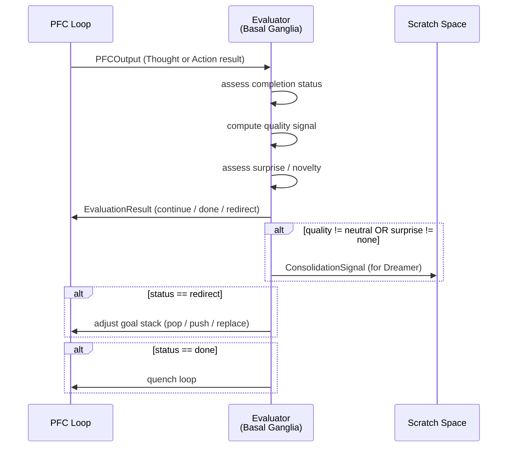

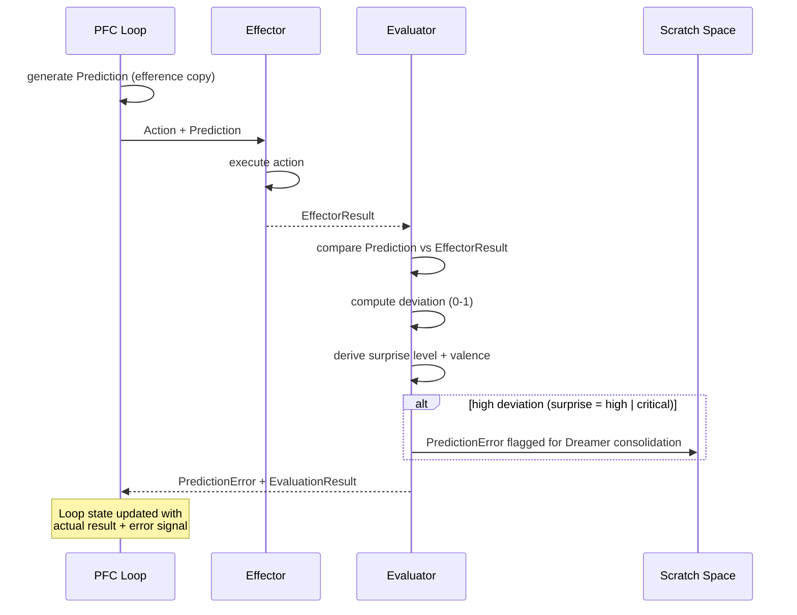


---

## 7. Effectors

**Brain analog: Motor Cortex + Premotor Cortex + Efference Copy** — the motor cortex does not think in individual muscle contractions. It operates at the level of *intent*: "grasp the cup." The premotor cortex handles motor planning — decomposing that intent into a coordinated sequence of muscle activations. And before each movement, the brain generates an *efference copy*: a forward-model prediction of the expected sensory result. When the actual result deviates from the prediction, that error signal drives learning and rapid correction.

This architecture mirrors that hierarchy. The PFC operates at the level of **intent** — "what do I want to perceive?" and "what do I want to change?" — not at the level of file operations or shell commands. The three effectors visible to the PFC are:

1. **respond** — Communicate to the user. The simplest effector: takes a message, delivers it. No internal tool use.
2. **sense** — Perceive and investigate. An LLM with internal tools (readFile, bash) that takes a high-level task like "understand this codebase" and autonomously figures out how to gather the information. Returns structured findings (entities, observations, relationships, summary). This is *active sensing* — PFC-directed exteroceptive perception, architecturally an effector whose output feeds back through the sensor pathway. See Section 3.1 for the full design.
3. **act** — Execute and change. An LLM with internal tools (readFile, writeFile, bash) that takes a high-level task like "write a CSV parser to utils" and autonomously figures out how to accomplish it. Returns structured results (summary, list of changes, verification status). Mirrors sense's architecture exactly but for mutation instead of perception.

The key design insight: **readFile, writeFile, and bash are NOT PFC-level concepts.** They are internal tools of sense and act — implementation details hidden behind intent-level interfaces. The PFC never decides "I should call readFile on path X." It decides "I need to understand X" (sense) or "I need to create/modify X" (act), and the effector handles the planning and execution internally.

Both sense and act follow the same internal architecture: an LLM in a tool-use loop with a maximum iteration budget, JSON-based tool calling, and a structured result format. The difference is scope — sense has read-only tools (readFile, bash for investigation), while act has read-write tools (readFile, writeFile, bash for execution). Both verify their own work and return structured results to the Evaluator.

```typescript
/** The PFC Loop's forward-model prediction for an action. */
interface Prediction {
  expectedResult: string;       // natural-language description of expected outcome
  expectedEmbedding?: number[]; // optional dense vector for numeric comparison
  confidence: number;           // 0–1, how confident the PFC is in this prediction
}

/** The result returned after an effector executes. */
interface EffectorResult {
  success: boolean;
  data: unknown;                // the actual return value
  error?: string;
  durationMs: number;
}

/** The contract every effector implements. */
interface Effector<TAction = unknown> {
  id: string;
  type: string;                 // "respond" | "sense" | "act"
  /** Execute the action and return the raw result. */
  execute(action: TAction): Promise<EffectorResult>;
}
```

### 7.1 The Three-Effector Model

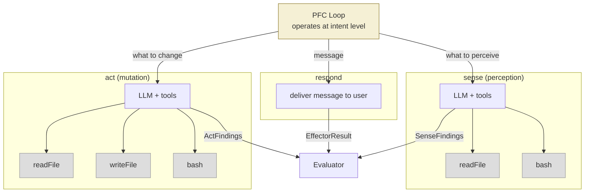

The internal tools (shown in gray) are invisible to the PFC. This is the architectural equivalent of the premotor cortex: the PFC says "grasp the cup," and motor planning decomposes that into a coordinated sequence of operations. The PFC does not micromanage individual file reads or shell commands.

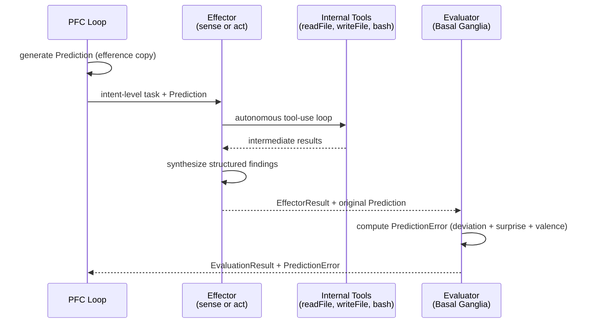

---


## 8. Memory Hierarchy

**Brain analog: Sensory Registers -> Hippocampal Short-Term Index -> Cortical Synaptic Structure**

The brain does not store everything it processes. It maintains a strict hierarchy: electrical activity in prefrontal loops (working memory, token-budget-bounded, seconds), hippocampal indexing (short-term, days/weeks), and cortical synaptic consolidation (long-term, years/permanent). Each tier trades off capacity against persistence. This architecture mirrors that hierarchy exactly.

The critical design rule: **the PFC Loop never writes directly to the knowledge graph.** It writes to scratch space. The Dreamer decides what gets promoted. This mirrors the biological reality -- you do not form long-term memories during active reasoning. Consolidation happens during sleep.

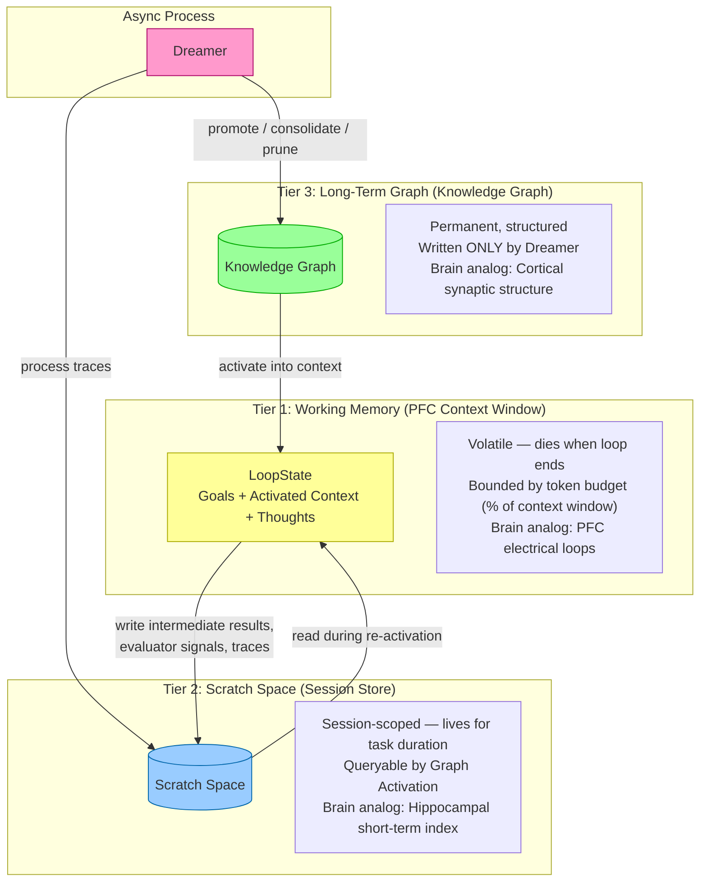

### Tier 1: Working Memory (LLM Context Window)

This IS the LLM's context window. It holds the current `LoopState` -- the active goal stack, the activated subgraph from Graph Activation, and the reasoning thoughts accumulated during the current loop. It is bounded by a token budget (a configurable percentage of the context window), with space dynamically allocated across its components. When the working memory portion approaches its budget, older thoughts are compressed into summaries rather than evicted, preserving information at reduced fidelity.

Working memory is volatile. When the loop ends, it is gone. Anything worth keeping must be written to scratch space before the loop terminates.

### Tier 2: Scratch Space (Session Store)

The hippocampal short-term index. Scratch space persists across loop iterations within a session but is not permanent. This is where intermediate results, evaluator signals, **active sensing findings**, prediction errors, and full interaction traces land.

Scratch space is queryable -- the Graph Activation layer can read from it during re-activation, pulling in relevant prior observations from earlier in the session. Implementation could be a temporary subgraph, a session-scoped document store, or literal files on disk.

### Tier 3: Long-Term Graph (Knowledge Graph)

The cortical synaptic structure. Permanent, structured knowledge with high stability and low maintenance cost. The knowledge graph is only written to by the Dreamer during consolidation (and during initial bootstrapping). The PFC Loop cannot directly mutate it.

This separation is what prevents the system from polluting long-term knowledge with half-formed thoughts, hallucinations, or low-confidence observations from a single interaction.

```typescript
/** Which memory tier a piece of data lives in. */
type MemoryTier = "working" | "scratch" | "longterm";

/** A single trace written to scratch space during a loop iteration. */
interface ScratchTrace {
  id: string;
  sessionId: string;
  loopIterationId: string;
  timestamp: number;
  type: "thought" | "action_result" | "prediction_error" | "evaluator_signal" | "observation";
  content: string;
  embedding: number[];
  /** Evaluator-annotated signals, populated after the evaluator runs. */
  evaluatorAnnotation?: {
    quality: EvaluationResult["quality"];
    surprise: EvaluationResult["surprise"];
    predictionError?: PredictionError;
    tags: string[];           // e.g. ["novel_pattern", "contradiction", "confirms_prior"]
  };
  /** References to related graph nodes, if any. */
  relatedNodeIds: string[];
  /** Whether the Dreamer has already processed this trace. */
  consolidated: boolean;
}

/** Session-scoped scratch space. */
interface ScratchSpace {
  sessionId: string;
  createdAt: number;
  traces: ScratchTrace[];
  /** Write a new trace. Called by the PFC Loop and Evaluator. */
  write(trace: Omit<ScratchTrace, "id" | "consolidated">): string;
  /** Query traces by embedding similarity, type, or recency. */
  query(opts: {
    embedding?: number[];
    type?: ScratchTrace["type"];
    minQuality?: number;
    minSurprise?: number;
    limit?: number;
  }): ScratchTrace[];
  /** Mark traces as consolidated (called by the Dreamer). */
  markConsolidated(traceIds: string[]): void;
  /** Purge the session's scratch space. */
  clear(): void;
}

/** Describes a memory item's position in the hierarchy. */
interface MemoryEntry {
  tier: MemoryTier;
  id: string;
  content: string;
  embedding: number[];
  confidence: number;         // 0–1, how reliable this memory is
  accessCount: number;        // how many times it has been activated
  lastAccessed: number;
  createdAt: number;
  source: "sensor" | "reasoning" | "consolidation" | "bootstrap";
}
```

---

## 9. Dreamer (Consolidation)

**Brain analog: Sleep Consolidation (hippocampal replay -> cortical integration)**

During sleep, the brain replays hippocampal traces -- reactivating the day's experiences in compressed form, strengthening important synaptic connections, pruning irrelevant ones, and integrating new information with existing cortical knowledge. The Dreamer is this process.

The Dreamer runs **asynchronously**, outside the reasoning loop. It is not part of any request/response cycle. It processes the scratch space traces that the Evaluator has annotated with quality and surprise signals, and it is the **only component that writes to the long-term knowledge graph** (besides initial bootstrapping).

### Consolidation Operations

Traces include PFC reasoning, effector results, evaluator signals, **and structured findings from active sensing** — all annotated with quality and surprise signals by the Evaluator.

The Dreamer performs four operations, prioritizing high-surprise, high-consequence traces:

1. **Promote** -- Identify observations worth keeping and add them as new nodes/edges in the knowledge graph. High-quality, high-surprise traces get promoted first.
2. **Consolidate** -- Merge redundant observations. If scratch space contains five traces that all say the same thing, they become one strengthened node.
3. **Prune** -- Discard low-quality, low-surprise observations that add no information. These traces are marked consolidated and never promoted.
4. **Strengthen/Weaken** -- Adjust edge weights and node confidence in the existing graph based on frequency and quality signals from new traces. A fact confirmed by multiple high-quality observations gets stronger. A fact contradicted by a high-surprise observation gets weaker.

### Surprisal-Weighted Exploration

The Dreamer can use random walks on a surprisal-weighted graph to discover novel or anomalous patterns in scratch space -- traces that are structurally distant from existing graph knowledge, or that create unexpected connections between previously unrelated nodes. This is analogous to the brain's tendency to form novel associations during REM sleep.

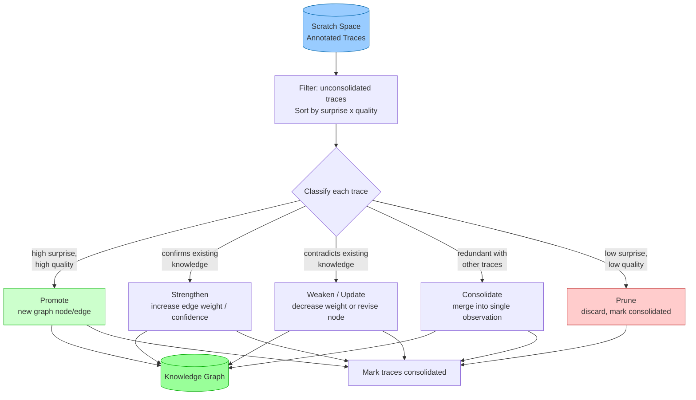

```typescript
/** A trace the Dreamer is about to process, with its classification. */
interface DreamerTrace {
  trace: ScratchTrace;
  classification: "promote" | "consolidate" | "prune" | "strengthen" | "weaken";
  /** If consolidate/strengthen/weaken, which existing graph node(s) are affected. */
  targetNodeIds: string[];
  /** Computed priority score: surprise * quality * recency bias. */
  priority: number;
}

/** The result of a single consolidation operation. */
interface ConsolidationResult {
  traceId: string;
  action: DreamerTrace["classification"];
  /** New node IDs created (for promote). */
  createdNodeIds: string[];
  /** Existing node IDs modified (for strengthen/weaken/consolidate). */
  modifiedNodeIds: string[];
  /** Existing node IDs removed (for consolidate merges). */
  removedNodeIds: string[];
  /** Net confidence delta applied to affected nodes. */
  confidenceDelta: number;
  /** Net weight delta applied to affected edges. */
  weightDelta: number;
  timestamp: number;
}

/** The Dreamer's top-level interface. */
interface Dreamer {
  /** The Dreamer holds a reference to the graph service for write operations. */
  graphService: GraphActivationService;
  /** Run a consolidation cycle over unconsolidated scratch traces. */
  consolidate(scratchSpace: ScratchSpace): Promise<ConsolidationResult[]>;
  /** Perform a surprisal-weighted random walk to find anomalous patterns. */
  explore(scratchSpace: ScratchSpace, steps: number): Promise<DreamerTrace[]>;
  /** Get the current consolidation backlog size. */
  backlogSize(scratchSpace: ScratchSpace): number;
  /**
   * Phase 2: examine recently promoted nodes and extract cross-cutting patterns.
   * Returns newly created pattern nodes.
   */
  abstractPatterns(window?: { since: number }): Promise<{ patterns: DetectedPattern[]; results: ConsolidationResult[] }>;
}
```

### Pattern Abstraction (Phase 2)

Phase 1 processes scratch traces and promotes individual observations into graph nodes. Phase 2 takes the Dreamer's own output as input: it examines recently promoted nodes across multiple sessions and detects recurring patterns.

When the Dreamer finds that multiple separate observations are instances of the same underlying phenomenon, it creates a new node representing the abstract pattern and connects it to all the instance nodes. This is just regular graph formation -- patterns become nodes, instances become edges.

**The recursive structure:** Phase 1 inputs are scratch traces. Phase 2 inputs are recently promoted nodes. The Dreamer's own output becomes its next input.

**Examples:**

- Three incidents where debug security groups weren't reverted -> new node `"debug-security-group-drift"` (type `"pattern"`), connected to all three incident nodes via `"instance_of"` edges
- Five observations that major version bumps of package X break API compatibility -> new node `"package-X-major-version-risk"` (type `"pattern"`)
- Repeated failure when acting on vague requests without clarification -> new node `"vague-request-clarification-needed"` (type `"pattern"`)

A pattern node is just a `GraphNode` with `type: "pattern"`. No new data structures -- it has observations (summarizing the abstract pattern), edges to its instance nodes (relation `"instance_of"`), and confidence/weight like everything else. Once created, a pattern node activates on future related queries and informs the PFC's reasoning before the specific failure occurs again. The first time a security group issue happens, it's a fact. The third time, it's a pattern.

**This is how skills emerge implicitly.** Rather than explicit skill files or rigid instruction templates, skills in this system are high-confidence pattern nodes that consolidated naturally from repeated experience. They aren't hand-authored -- they're abstract observations that emerged from the graph structure. A pattern node with high confidence and many instance edges is, functionally, a skill: it encodes "when you see X, Y tends to happen" as a graph structure that activates automatically during retrieval.

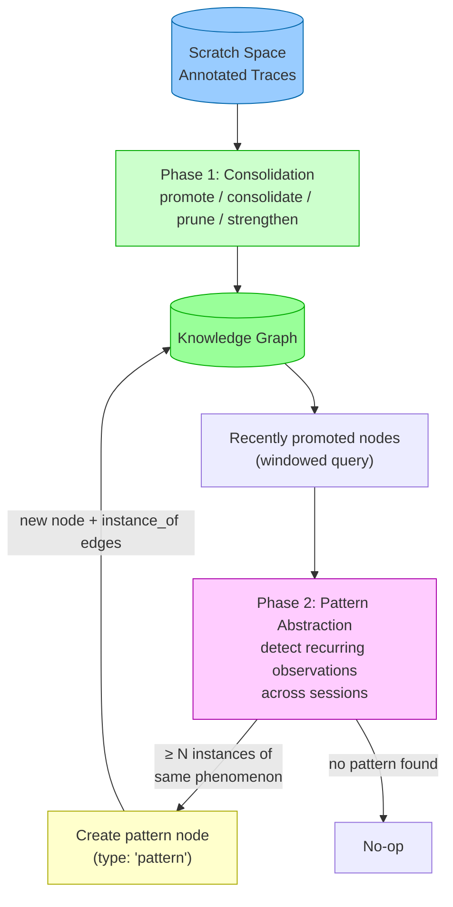

```typescript
/** A pattern detected during Phase 2 abstraction. */
interface DetectedPattern {
  /** Human-readable name for the pattern (becomes the node name). */
  name: string;
  /** Summary observation describing the abstract pattern. */
  summary: string;
  /** IDs of the instance nodes that exhibit this pattern. */
  instanceNodeIds: string[];
  /** Confidence that this is a real pattern, not coincidence. 0-1. */
  confidence: number;
}
```

---

## 10. Full System Flow

This section traces a complete end-to-end interaction: a user sends a message, the system reasons over multiple loop iterations (including a sub-goal), encounters a prediction error, self-corrects, and the Dreamer later consolidates the session.

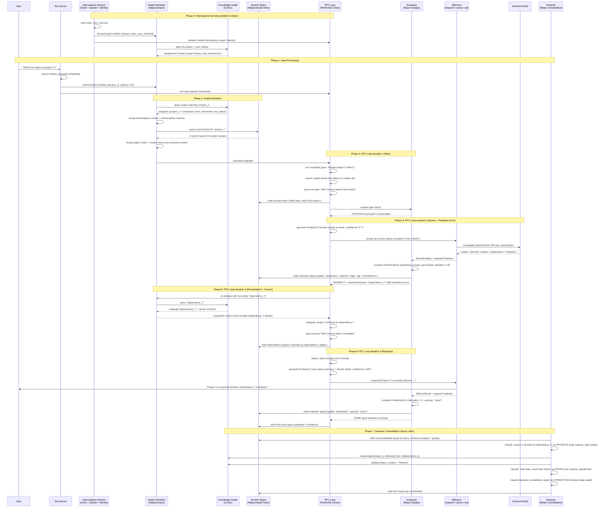

### Reactivation in This Example

Note that Phase 0 (interoceptive sensing) runs before any external input arrives. The Spatial sensor contributes entities like `project_brain` that activate background graph context — the PFC already knows "where it is" before the user's question arrives. This ambient context merges with the exteroceptive activation in Phase 2.

For reactivation: only iteration 3 triggers it — and it does so because the Evaluator's high surprise signal from iteration 2 (prediction error: predicted "on-track", got "blocked", deviation: 0.8) produced a `reactivationQuery` for "dependency_Y". Iteration 1 is a planning thought with empty `reactivationHints`, so no reactivation. Iteration 2 is an effector action whose result triggers the surprise-driven reactivation. Iteration 4 is a response action with low prediction error (deviation: 0.1), so no reactivation. This is the typical pattern: most iterations run with no reactivation overhead.

### Goal Stack Behavior

The PFC Loop maintains a goal stack within `LoopState`. The flow above demonstrates the core pattern:

1. **Push** -- The top-level goal ("answer project X status") is set during initialization. When the PFC determines it needs fresh data, it pushes a sub-goal ("fetch current status from tracker").
2. **Execute** -- The PFC works on the top-of-stack goal. The effector call and prediction error handling all occur in service of this sub-goal.
3. **Pop** -- Once the sub-goal is satisfied (status fetched, prediction error processed, context re-activated), it is popped. Control returns to the parent goal.
4. **Quench** -- When the top-level goal is satisfied, the Evaluator sends a QUENCH signal and the loop terminates.

Sub-goals can nest arbitrarily. If fetching the status had required authentication, the PFC would push another sub-goal ("authenticate with tracker"), resolve it, pop it, and continue with the fetch.

### Data Flow Summary

| From | To | What | When |
|------|----|------|------|
| Exteroceptive Sensor | Graph Activation | SensorOutput (annotations) | Every input |
| Exteroceptive Sensor | PFC Loop | Raw input | Every input (always, even on cold start) |
| Interoceptive Sensor | Graph Activation | SensorOutput (entities, embedding if applicable) | Every loop initialization |
| Interoceptive Sensor | PFC Loop | Ambient context (time, location, identity) | Every loop initialization |
| Graph Activation | Knowledge Graph | Entity/embedding query | Every activation |
| Graph Activation | Scratch Space | Session trace query | During re-activation |
| Graph Activation | PFC Loop | Activated subgraph | Loop initialization + re-activation |
| PFC Loop | Scratch Space | Thoughts, observations | Every iteration |
| PFC Loop | Effector (respond/sense/act) | Intent-level task + Prediction | When acting |
| Effector (respond/sense/act) | Evaluator | EffectorResult + Prediction | After every action |
| Evaluator | PFC Loop | CONTINUE / REDIRECT / QUENCH | After every evaluation |
| Evaluator | Scratch Space | Quality + surprise signals | After every evaluation |
| Dreamer | Scratch Space | Read unconsolidated traces | Async, periodic |
| PFC Loop | sense effector | SensePayload (task + source + hints) | When perceiving/investigating |
| PFC Loop | act effector | ActPayload (task + context) | When executing/changing |
| sense effector | Evaluator | SenseFindings | After investigation completes |
| act effector | Evaluator | ActFindings | After execution completes |
| Evaluator | Scratch Space | Annotated sense/act observations | After evaluating effector findings |
| Dreamer | Knowledge Graph | Promote / consolidate / prune / adjust | Async, periodic |

