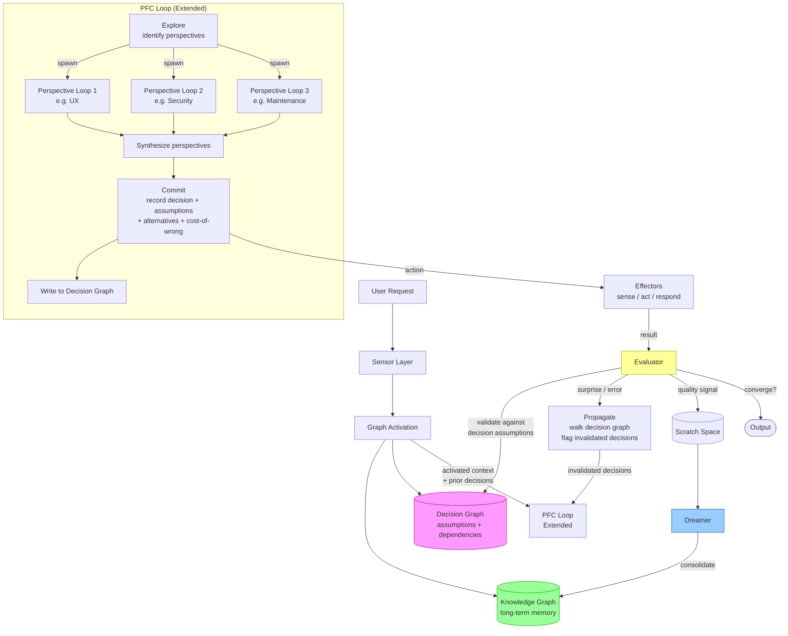
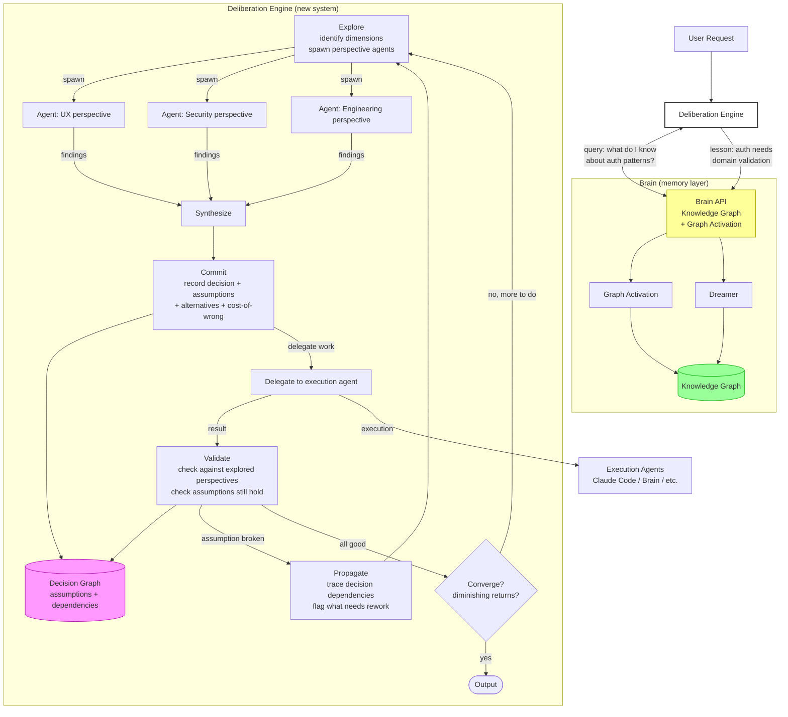
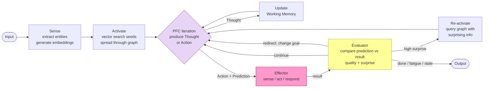
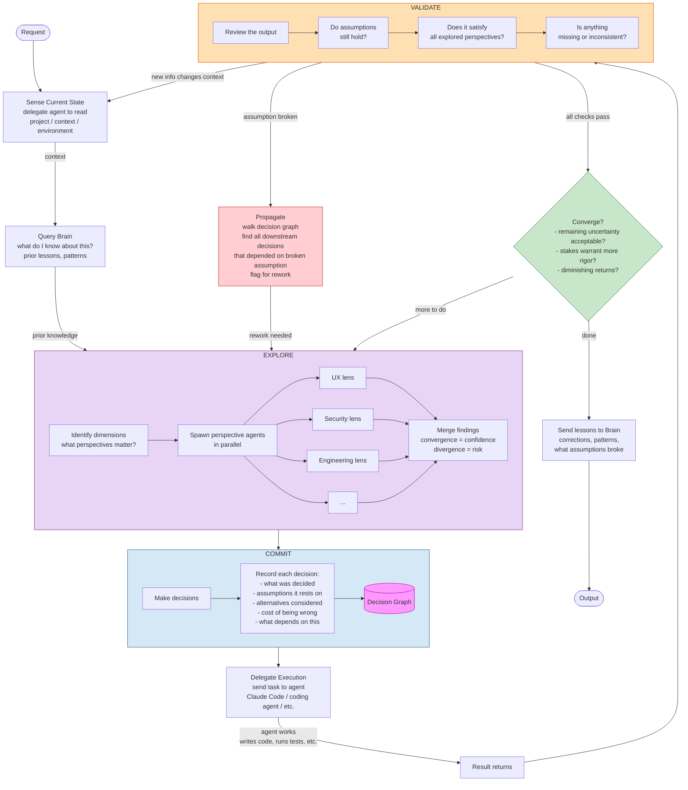
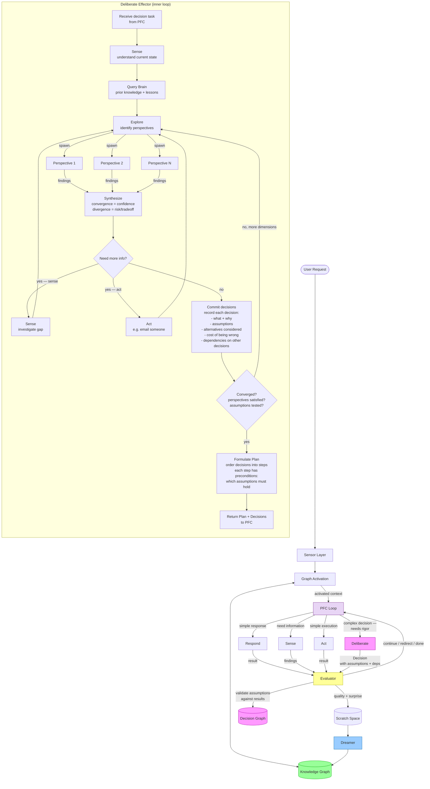

# Deliberation Engine: Integration Options

Two options for how the deliberation loop (Explore, Commit, Track, Validate, Propagate, Converge) relates to the brain architecture.

---

## Option A: Integrated into Brain

The brain's PFC loop is extended to produce Decisions (not just Thoughts/Actions). A new Decision Graph sits alongside the Knowledge Graph. The PFC can spawn parallel perspective loops. The Evaluator validates against both the decision assumptions and the knowledge graph.



**What changes in brain:**
- PFC loop learns to produce `Decision` objects (assumptions, alternatives, cost)
- New Decision Graph alongside Knowledge Graph (separate store, different schema)
- PFC gains ability to spawn parallel perspective sub-loops (mini PFC instances)
- Evaluator extended to validate against decision assumptions, not just prediction error
- New Propagate step: when assumption breaks, walk decision graph to find affected decisions
- Dreamer unchanged — still consolidates scratch traces to knowledge graph
- Sensor layer unchanged
- Graph activation queries both knowledge graph AND decision graph

**Complexity:** High. Touches almost every component. The PFC loop becomes significantly more complex. Two different graph schemas to maintain. Perspective sub-loops are a new execution model.

---

## Option B: Separate Deliberation Engine

The Deliberation Engine is its own system. It owns the decision lifecycle (Explore, Commit, Track, Validate, Propagate, Converge). It delegates execution to agents — which could be brain instances, Claude Code, or any other tool. The brain becomes the memory/learning layer that the engine queries for context and writes lessons back to.



**What changes:**
- Brain stays as-is (or gets simplified to just the memory layer: graph, activation, dreamer)
- Brain exposes an API: `query(text) → context` and `learn(lesson) → void`
- PFC loop, sensors, evaluator, scratch space — either stay for brain's own use or get dropped
- New system owns: Explore, Commit, Track (decision graph), Validate, Propagate, Converge
- Perspective agents are just LLM calls with different system prompts — not brain instances
- Execution agents are external tools (Claude Code, etc.) — the engine doesn't execute, it orchestrates

**Complexity:** Lower per-system. Each system is focused. But there are now two systems to maintain and an API boundary between them.

---

## Side-by-Side Comparison

| Dimension | A: Integrated | B: Separate |
|-----------|--------------|-------------|
| **Brain changes required** | Major — PFC, Evaluator, new graph, sub-loops | Minor — expose API, possibly simplify |
| **Decision graph** | Lives inside brain, alongside knowledge graph | Lives in deliberation engine, separate system |
| **Perspective exploration** | PFC spawns sub-loops (new execution model) | Engine spawns agents (just parallel LLM calls) |
| **Execution** | Brain's effectors (sense/act) | External agents (Claude Code, etc.) |
| **Memory/learning** | Brain's dreamer consolidates everything | Brain is called as a service for context + learning |
| **Can use without brain** | No | Yes — engine works standalone, brain is optional enrichment |
| **Can use brain without engine** | Yes — brain still works as before | Yes — brain is independent |
| **Time to something usable** | Longer — refactoring existing code | Shorter — new focused system |
| **Risk of over-engineering** | Higher — adding complexity to existing complex system | Lower — clean separation of concerns |
| **Where the decision graph lives** | Coupled to brain's storage layer | Independent, portable |

---

## Loop Comparison

### Brain Loop (Current)

A single recurrent reasoning loop. Input enters, the PFC thinks iteratively, acts, evaluates, and loops until done. Everything happens inside one loop with one set of state.



**What's in the loop:** Think → Act → Evaluate → Think again.
**What drives the loop:** The Evaluator decides continue/redirect/stop.
**What's tracked:** Working memory (thoughts), goal stack, prediction errors.
**What's NOT tracked:** Which decisions depend on which assumptions. What alternatives were considered. What breaks if an assumption is wrong.

---

### Deliberation Engine Loop (Proposed)

A multi-phase loop where exploration and validation are explicit phases, not implicit side effects. The engine explores the space, makes decisions with tracked assumptions, delegates execution, validates results against those assumptions, and propagates changes when assumptions break.



**What's in the loop:** Sense → Explore → Commit → Delegate → Validate → (Propagate) → Converge → loop or done.
**What drives the loop:** Validation failures and convergence judgment.
**What's tracked:** Every decision, its assumptions, alternatives, dependencies, and cost-of-wrong.
**What's NOT in this loop:** The brain's PFC reasoning. That's been replaced by the deliberation phases. The brain provides memory, not reasoning.

---

### Key Differences

| Aspect | Brain Loop | Deliberation Loop |
|--------|-----------|-------------------|
| **Unit of progress** | A Thought or an Action | A Decision (with assumptions) |
| **Exploration** | Implicit — whatever the PFC thinks about | Explicit phase — spawn perspectives, merge findings |
| **When sensing happens** | Passive (input arrives) or active (PFC requests) | At the start of each cycle + when validation reveals missing context |
| **Evaluation** | After each action: did prediction match? | After each execution: do assumptions still hold? Do all perspectives pass? |
| **What triggers re-work** | High surprise on a single prediction | A broken assumption that invalidates downstream decisions |
| **Scope of re-work** | Re-activate graph context for the surprising thing | Walk the decision graph and rework everything downstream |
| **Learning** | Dreamer consolidates scratch traces after session | Lessons sent to brain after convergence |
| **Execution** | Brain's own effectors (sense/act with internal tools) | Delegated to external agents (Claude Code, etc.) |
| **Parallel reasoning** | Single PFC loop, sequential iterations | Multiple perspective agents in parallel |
| **Termination** | Evaluator says done, or fatigue, or stale state | Convergence judgment: is remaining uncertainty acceptable? |

---

---

## Option C: Deliberation as a Nested Loop (New Effector)

The brain stays as-is. Deliberation is added as a new effector — like sense and act, but higher-level. When the PFC faces a decision that warrants rigor, it triggers the deliberate effector, which runs its own inner loop. That inner loop can call sense, act, and respond. It returns a structured Decision to the PFC.

The key insight: sense and act are already inner loops (an LLM with tools that runs autonomously). Deliberation is the same pattern, but its tools are sense, act, AND perspective spawning. It sits one level above.

### Architecture



### The Decision Lifecycle (across the outer + inner loops)

This is the full picture of how a Decision is born, executed, and validated — showing how the inner deliberation loop and the outer PFC loop work together.

```mermaid
sequenceDiagram
    participant User
    participant PFC as PFC Loop (outer)
    participant DEL as Deliberate Effector (inner)
    participant SENSE as Sense Effector
    participant ACT as Act Effector
    participant EVAL as Evaluator
    participant DG as Decision Graph
    participant KG as Knowledge Graph

    User->>PFC: "Add auth to the project"
    PFC->>PFC: This is complex — trigger deliberation

    Note over DEL: Inner loop begins

    PFC->>DEL: deliberate("how should we implement auth?")

    DEL->>SENSE: sense("read the project, what auth exists?")
    SENSE-->>DEL: findings (no auth, Express app, PostgreSQL)

    DEL->>KG: query("auth patterns, prior lessons")
    KG-->>DEL: context (last time forgot password reset, JWT had revocation issues)

    DEL->>DEL: Identify perspectives: UX, Security, Engineering, Ops

    par Perspective exploration
        DEL->>DEL: UX lens — frictionless login, error states, password reset
        DEL->>DEL: Security lens — threat model, token storage, MFA
        DEL->>DEL: Engineering lens — session management, middleware, testing
        DEL->>DEL: Ops lens — session store scaling, monitoring, rotation
    end

    DEL->>DEL: Synthesize — UX and Security diverge on MFA friction
    DEL->>DEL: Need more info — what's the user base size?
    DEL->>SENSE: sense("check analytics for user count")
    SENSE-->>DEL: findings (500 users, internal tool)
    DEL->>DEL: Low user count — MFA optional, not mandatory. Divergence resolved.

    DEL->>DEL: Commit Decisions + Formulate Plan
    DEL->>DG: Record decisions with assumptions
    Note over DG: Decision 1: session-based auth (not JWT)<br/>  Assumes: internal tool, no SSO requirement<br/>  Cost if wrong: migrate to SSO ~2 days<br/><br/>Decision 2: bcrypt for passwords<br/>  Assumes: PostgreSQL stays<br/>  Cost if wrong: low, bcrypt is portable<br/><br/>Decision 3: optional MFA<br/>  Assumes: 500 users, low risk<br/>  Cost if wrong: make mandatory later ~1 day

    DEL-->>PFC: Plan (ordered steps with preconditions)
    Note over PFC: Plan:<br/>Step 1: Create user model + migration [assumes: PostgreSQL]<br/>Step 2: Build auth middleware [assumes: Express, session-based]<br/>Step 3: Build login/register pages [assumes: step 1+2 done]<br/>Step 4: Add password reset flow [assumes: email service exists]<br/>Step 5: Add optional MFA [assumes: step 3 done, low user count]<br/>Step 6: Add session cleanup on deploy [assumes: session store choice]

    Note over DEL: Inner loop ends
    Note over PFC: PFC executes plan step by step

    PFC->>ACT: act("Step 1: Create user model + migration")
    ACT-->>EVAL: result (migration created, model works)
    EVAL->>DG: Check: PostgreSQL assumption still valid? ✓
    EVAL-->>PFC: continue — assumptions hold, proceed to step 2

    PFC->>ACT: act("Step 2: Build auth middleware")
    ACT-->>EVAL: result (middleware created)
    EVAL->>DG: Check: Express assumption? ✓ Session-based? ✓
    EVAL-->>PFC: continue — proceed to step 3

    PFC->>ACT: act("Step 3: Build login/register pages")
    ACT-->>EVAL: result (pages created, but discovers app uses Hono not Express)
    EVAL->>DG: Check: Express assumption? ✗ BROKEN
    Note over EVAL: Assumption "Express app" was wrong.<br/>Propagate: which steps depend on this?<br/>Step 2 (auth middleware) — INVALIDATED, was built for Express<br/>Step 3 (pages) — partially done, middleware imports wrong<br/>Steps 4-6 — not yet executed, will need Hono-compatible middleware

    EVAL-->>PFC: redirect — broken assumption, re-deliberate from step 2

    PFC->>DELIBERATE: deliberate("re-plan auth middleware for Hono instead of Express")
    Note over DELIBERATE: Scoped re-deliberation:<br/>- Only re-explores the affected decisions<br/>- Keeps decisions that don't depend on Express<br/>- Updates plan from step 2 onward

    DELIBERATE-->>PFC: Updated plan (steps 2-6 revised for Hono)

    PFC->>ACT: act("Step 2 (revised): Rebuild auth middleware for Hono")
    ACT-->>EVAL: result
    EVAL->>DG: Assumptions hold ✓
    EVAL-->>PFC: continue

    Note over PFC: ...continues executing revised plan...

    PFC->>KG: learn("this project uses Hono not Express; always sense the framework before assuming")
```

### What This Gives You

**The PFC loop is unchanged.** It still thinks, acts, evaluates, loops. The only addition is a new effector type it can trigger.

**Deliberation produces a plan, not just decisions.** The inner loop converges on a set of decisions, then orders them into a plan — a sequence of steps where each step has preconditions (which assumptions must still be true for this step to make sense). The PFC executes the plan step by step, not all at once.

**Every step is validated before proceeding.** After each step, the Evaluator checks: do the assumptions for this step and all downstream steps still hold? If yes, continue. If no, the Evaluator identifies which steps are invalidated and triggers scoped re-deliberation — only re-exploring the affected decisions, not starting over from scratch.

**Propagation is concrete, not abstract.** When an assumption breaks at step 3, you don't walk an abstract graph. You look at the plan: which later steps depended on that assumption? Those get flagged. The tail of the plan gets re-deliberated. Steps that don't depend on the broken assumption are unaffected.

**Deliberation is opt-in.** The PFC decides when to deliberate. Simple tasks skip it entirely. Complex or high-stakes tasks trigger it. The Evaluator could also suggest deliberation retroactively ("this action had high prediction error — should we have deliberated first?").

**The inner loop has access to everything.** It can sense (read code, fetch URLs), act (send emails, create tickets), query the knowledge graph, and spawn parallel perspective agents. It's not limited.

**Decisions are first-class objects.** They get recorded in the Decision Graph with assumptions, alternatives, and dependencies. The Evaluator validates against them after every execution step.

**It can start simple.** V0 of the deliberate effector could literally be a single LLM call with a structured output format: "given this task, what are the perspectives, what are you assuming, what's the decision, what's the plan?" No inner loop, no parallel agents. Just a prompt that forces the rigor. Then iterate from there.

### What's New to Build

| Component | Exists? | Work needed |
|-----------|---------|-------------|
| PFC Loop | Yes | Add "deliberate" as a new effector trigger (small change) |
| Sense effector | Yes | None — deliberate calls it as-is |
| Act effector | Yes | None — deliberate calls it as-is |
| Respond effector | Yes | None |
| Evaluator | Yes | Extend to validate against Decision Graph assumptions |
| Deliberate effector | **New** | The inner loop: sense → query → explore → synthesize → commit |
| Decision Graph | **New** | Schema for decisions, assumptions, dependencies |
| Decision type | **New** | Data structure: decision + assumptions + alternatives + deps |
| Perspective spawning | **New** | Parallel LLM calls with different system prompts |
| Propagation logic | **New** | Walk decision graph when assumption breaks |
| Knowledge Graph | Yes | None |
| Dreamer | Yes | None |
| Sensors | Yes | None |

---

## Three Options Summary

| | A: Integrated | B: Separate System | C: New Effector |
|---|---|---|---|
| **Core idea** | Extend PFC to produce Decisions | Build separate engine, brain is a service | Add deliberation as an effector the PFC can trigger |
| **Brain changes** | Major | Minor (expose API) | Moderate (new effector + decision graph) |
| **New systems** | 0 (all inside brain) | 1 (deliberation engine) | 0 (inside brain, new effector) |
| **Deliberation has access to sense/act** | Yes, through PFC | Yes, through delegation | Yes, directly |
| **Can start simple** | Hard — need to rework PFC first | Medium — new system from scratch | Easy — v0 is one structured prompt |
| **Decision graph location** | Inside brain | Inside engine | Inside brain |
| **Risk** | Over-complicates the PFC | Two systems to maintain | Deliberate effector might outgrow effector pattern |

---

## The Key Question

Option A treats deliberation as a feature of the brain. Option B treats the brain as a service the deliberation engine can use. Option C treats deliberation as a capability the brain can invoke — a new tool in its existing toolkit.

The risk with C is that the deliberation effector eventually becomes more complex than the PFC itself — the tail wagging the dog. But that's a future problem, and if it happens, it's a natural migration path to Option B (extract the effector into its own system).

---

## Adversarial Review

Four independent reviewers examined the VISION and architecture options. Their feedback is preserved verbatim below, followed by a synthesis and the author's responses.

### Review 1: Skeptical Technical Critic

**1. What's hand-wavy or underspecified**

**Convergence is a blank check.** The document says the system should recognize "when further iteration isn't worth the cost" and calls this "judgment." But judgment is precisely what LLMs lack. How does the system compute diminishing returns? There is no proposed metric, no heuristic, no threshold. "How critical is this task? How high are the stakes?" — who decides? Another LLM call? You've just moved the problem up a level.

**Perspective spawning is undefined.** "Spawn perspective agents" appears in every option, but there is zero specification of how perspectives are selected. The auth example conveniently picks UX/Security/Engineering/Ops — but how does the system know those are the right lenses for an arbitrary task? A hard-coded list won't generalize. An LLM choosing lenses is just another unvalidated decision.

**The Decision Graph has no schema.** Both documents reference a Decision Graph with "assumptions + dependencies" but never define the data model. What is an assumption, structurally? A string? A predicate that can be evaluated? How are dependency edges created — manually by the LLM, or inferred? This is the core data structure of the entire system and it is completely unspecified.

**Propagation is described but not mechanized.** "Walk the decision graph and find all downstream decisions" sounds clean. But the graph is populated by natural language from an LLM. How do you determine that "assumes Express" in Decision 2 is invalidated by the discovery of Hono in Step 3? That requires semantic matching between free-text assumptions and free-text observations — which is itself an LLM call that can be wrong, creating a second-order reliability problem.

**2. What assumptions does the VISION itself make?**

- **That agents fail due to lack of structure, not lack of capability.** The document asserts "the bottleneck isn't capability — it's rigor." But if an agent can't reliably detect that an app uses Hono instead of Express during its initial sensing pass, wrapping it in a deliberation loop won't fix that. The deliberation loop is only as good as the LLM calls inside it.

- **That explicit assumption-tracking is possible at reasonable fidelity.** The system assumes an LLM can reliably enumerate its own assumptions. But LLMs are famously bad at metacognition. Asking an LLM "what are you assuming?" produces plausible-sounding lists that miss the actual load-bearing assumptions.

- **That users want this overhead.** The document opens with "small tasks take 10 minutes" as a pain point — then proposes a system that adds Explore, Commit, Track, Validate, Propagate, and Converge phases before any work happens. The cure may be worse than the disease for anything below a certain complexity threshold.

**3. What's the weakest link**

The **Validate phase**. Everything downstream depends on validation catching broken assumptions. But validation is an LLM reviewing another LLM's work against natural-language assumptions. This is the hardest problem in the entire system — it's essentially automated code review with semantic understanding of intent — and the document treats it as a straightforward step. If validation has a 20% miss rate, the entire propagation mechanism is unreliable, and you're back to silent error compounding.

**4. What existing work does this ignore**

- **MCTS/Tree-of-Thoughts (Yao et al., 2023)** — explicit exploration of reasoning branches with backtracking. Directly relevant, not mentioned.
- **DSPy (Khattab et al.)** — programmatic optimization of LLM pipelines with assertions and constraints. Overlapping goals.
- **Reflexion (Shinn et al., 2023)** — agents that maintain explicit verbal feedback for self-correction. The "propagate + learn" cycle reinvents this.
- **Devin, OpenHands, SWE-Agent** — coding agents that already implement plan-execute-validate loops in production. Their empirical failure modes would inform what actually breaks.

The document would be stronger if it positioned itself against these rather than only against "memory products" and "orchestration frameworks."

**5. Is the neuroscience grounding real or narrative?**

It is **well-informed narrative**. The brain region mappings are individually defensible — the ACC does detect conflict, the hippocampus does bind relations, the DMN does simulate perspectives. But the mapping is post-hoc: the six phases were designed first, then brain regions were matched to them. The neuroscience does not constrain or inform the design in any way that changes the architecture. You could remove the entire "Neuroscience Grounding" section and the system design would be identical. It is a legitimacy play, not an engineering input.

**6. Cost and feasibility**

One deliberation cycle for the auth example involves: 1 sensing call, 1 knowledge query, 1 perspective-identification call, 4 parallel perspective calls, 1 synthesis call, 1 additional sensing call, 1 commit/plan call. That is **~10 LLM calls before any code is written**. Each execution step adds ~2 more calls (execute + validate). A 6-step plan means ~22 calls minimum, assuming no propagation triggers re-deliberation.

At current rates for a capable model (Opus/Sonnet), that is roughly $0.50-2.00 per deliberation cycle and 3-8 minutes of latency for the pre-execution phase alone. For the "add auth" example, total cost could reach $5-10 and 15-30 minutes. This is viable for high-stakes tasks but not for the daily "small tasks take 10 minutes" pain point the document opens with. The vision document's own framing contradicts its feasibility for the majority of tasks it claims to address.

---

### Review 2: Product & UX Perspective

**1. Who is the user and what's their workflow?**

The document assumes the user is someone frustrated with Claude Code's shallow reasoning on complex tasks. That's real. But it never says what they actually do with Deliberate. Do they type a prompt into a new CLI? A VS Code extension? Do they prefix commands with something? The most natural answer is: this should be invisible. The user types the same thing they always type into Claude Code, and the system decides when to deliberate. If it requires a separate tool or interface, adoption is dead on arrival — nobody wants to context-switch to a "thinking tool" before using their "doing tool."

The honest answer about workflow timing: users reach for deeper deliberation on tasks where they've already been burned. "Last time I asked for auth it was a mess." That means the trigger is either user-initiated ("think hard about this") or learned from past failures. Option C gets this right by making deliberation opt-in at the PFC level.

**2. The latency problem**

This is the critical unsolved issue. The vision says small tasks take 10 minutes and that's painful. Then it proposes adding Explore (spawn N perspective agents in parallel), Synthesize, Commit, then execute. Even with parallel LLM calls, you're adding 30-90 seconds of deliberation before the first line of code. For the "add a button" class of tasks, this is strictly worse.

The document needs a triage function front and center: a fast classifier that decides in under 2 seconds whether a task warrants deliberation. Most tasks should skip it entirely. The Converge phase talks about effort-value computation, but that logic needs to run *before* exploration, not after. Without this, you've built a tool that makes thoughtful developers slower on the 80% of tasks that don't need it.

**3. Trust and control**

The documents are completely silent on what the human sees. Does the plan render in the terminal? Can the user say "skip the security perspective, this is a prototype"? Can they approve step-by-step or just get the final output? What happens when the user disagrees with a committed decision?

This matters because the core pitch is "agents are overconfident." If the deliberation engine is also overconfident — confidently exploring the wrong perspectives, confidently committing to assumptions the user knows are wrong — you've just added a slower layer of the same problem. The user needs to see the decision records (assumptions, alternatives, cost-of-wrong) and be able to override any of them before execution begins. A simple "here's my plan, approve/edit/reject" gate would solve most of this.

**4. The MVP**

One week, Option C, stripped to the bone:

- A single `deliberate` effector that is one structured LLM call (as the doc itself suggests in the "can start simple" row).
- Input: task description + project context.
- Output: a structured object with decisions, assumptions, alternatives, and an ordered plan.
- The PFC displays this to the user for approval before executing.
- No decision graph, no propagation, no perspective spawning, no parallel agents.

That's it. The core value proposition is: "before acting, the agent shows you what it's assuming and what could go wrong." That alone is a meaningful improvement over the status quo. Everything else — the graph, the propagation, the parallel perspectives — is iteration on top of a working foundation.

**5. Competitive positioning**

- **vs. Devin/Codex**: Those are execution engines. This is a reasoning layer. They compete on "do the work autonomously." You compete on "do the work *correctly* autonomously."
- **vs. Claude Code + good CLAUDE.md**: A CLAUDE.md is static instructions. This is dynamic, per-task reasoning. But honestly, 70% of the value in this vision doc could be captured by a really good CLAUDE.md that says "before acting, list your assumptions and alternatives." The remaining 30% — propagation, decision tracking across steps, learning from corrections — is where the real differentiation lives.
- **vs. Extended thinking**: Extended thinking is deeper reasoning within a single generation. This is structured reasoning across multiple generations and actions. Different axis.

**One-liner pitch**: "Deliberate makes AI agents show their work — surfacing assumptions, alternatives, and risks before committing — so you catch mistakes before they compound."

The risk: this is a product that makes agents slower and more verbose in exchange for correctness. That's the right trade for complex tasks and the wrong trade for simple ones. The entire product lives or dies on the quality of the triage decision.

---

### Review 3: Systems Architect

**1. Option C is right. But with a clear ejection plan.**

Option A is a refactor disguised as a feature — it rewrites the PFC core before you have any evidence the deliberation model works. Option B is premature extraction — you're building a second system and an API boundary before you know what the interface should be. Option C is the only one that lets you ship something this week.

The critical advantage: V0 of the deliberate effector is literally a single structured LLM call. No inner loop, no parallel agents, no decision graph. Just a prompt that forces the PFC to output decisions with assumptions, alternatives, and cost-of-wrong. You can validate whether the deliberation model improves output quality before investing in any infrastructure.

The document correctly identifies the risk: the effector outgrows the effector pattern. That is fine. If deliberation becomes the dominant mode of operation, you extract it into Option B. But you will have real usage data telling you exactly where the seams should be, instead of guessing now.

**2. Decision Graph: keep it flat until you can't.**

The schema should be a single SQLite table, not a graph database:

```sql
decisions(id, task_id, parent_id, statement, reasoning, assumptions JSON, alternatives JSON, cost_of_wrong TEXT, status ENUM(active|invalidated|superseded), created_at)
decision_deps(decision_id, depends_on_decision_id)
assumption_checks(decision_id, assumption_index, checked_at, held BOOLEAN, evidence TEXT)
```

Propagation is a simple recursive CTE on `decision_deps`: when an assumption fails, find the decision, walk `decision_deps` forward, mark descendants as invalidated. You already use `bun:sqlite` — this is a query, not a graph traversal algorithm. Do not build a separate graph store. The knowledge graph is for long-term associative memory. The decision graph is a short-lived task-scoped DAG that gets archived or consolidated after convergence.

**3. Perspectives: generated, not discovered.**

Hard-coding perspectives is brittle. Discovering them from the knowledge graph requires a mature graph you do not have yet. The right V0: a single LLM call that takes the task description + sensed context and outputs a list of relevant perspectives with reasoning for why each matters. The prompt should include a few canonical categories (user experience, security, maintainability, performance, operations) as a scaffold, but the model chooses which are relevant and can add domain-specific ones.

V1: the knowledge graph contributes. If prior tasks recorded lessons like "forgot to consider password reset flow," that context gets included in the perspective-generation prompt. Perspectives become a mix of generated (from the task) and recalled (from experience). This is exactly how the brain's default mode network works — it simulates based on both the current situation and prior experience.

Do not spawn parallel LLM calls for perspectives in V0. Have one call generate all perspectives, then one call synthesize them into decisions. Parallel calls are an optimization for when you have evidence that perspective quality improves with isolation.

**4. Plan structure: a DAG with assumption pointers, not a linked list.**

Each plan step needs:
- An ordered position (for default sequential execution)
- A list of `decision_ids` it depends on (which decisions must hold)
- A list of `step_ids` it depends on (which prior steps must complete)
- A status: pending, executing, completed, invalidated

When an assumption breaks: find the decision via `assumption_checks`, mark it invalidated, walk `decision_deps` to invalidate downstream decisions, then scan plan steps for any that reference invalidated decisions. Those steps flip to `invalidated`. The PFC re-deliberates only the invalidated portion. Steps with no dependency on the broken assumption are untouched.

This is a DAG, not a linked list. Step 5 (optional MFA) might depend on step 3 (login pages) but not on step 4 (password reset). If step 4's assumptions break, step 5 is unaffected.

**5. Integration: MCP server, not a proxy.**

The deliberation engine should expose itself as an MCP tool server. Claude Code already speaks MCP. The brain already has effectors that call tools. An MCP interface means:
- Claude Code can call `deliberate` as a tool, getting back a structured plan
- The brain's PFC can call it as an effector
- Any MCP-compatible agent gets deliberation for free

Do not build a CLI wrapper or proxy. Those create coupling to specific agent architectures. MCP is the universal interface. The deliberate tool accepts a task description and context, returns a plan with tracked decisions. The calling agent executes the plan and calls back with results for validation.

V0 is even simpler: the deliberate effector is internal to the brain, no MCP. When you extract to Option B, the MCP interface is how the now-separate engine communicates back.

---

### Review 4: Cognitive Scientist

**1. Are the brain mappings accurate?**

The mappings range from solid to stretched.

**Solid:** Explore/DMN is the strongest mapping. The DMN genuinely supports prospection, counterfactual simulation, and perspective-taking (Buckner & Carroll, 2007). Calling it the brain's "default" and linking that to the claim that exploration should be baseline, not optional, is a genuinely insightful design inference. Validate/ACC is also well-grounded — the ACC reliably signals prediction errors and response conflict (Botvinick et al., 2001). Converge/dACC+BG is reasonable; the basal ganglia do gate action selection, and the dACC does track foraging-like explore/exploit tradeoffs (Shenhav et al., 2013).

**Stretched:** Commit/BA10 oversimplifies. BA10 is involved in metacognition, yes, but also in branching — maintaining a secondary goal while pursuing a primary one (Koechlin et al., 1999). The document treats it as "monitoring your own reasoning" when its more specific function is *relational integration across subgoals*, which actually maps better to the Track phase. Track/Hippocampus is directionally correct but undersells the hippocampus. It doesn't just bind relationships — it supports *rapid one-shot learning* of novel conjunctions. That distinction matters for the design: if you take the hippocampal analogy seriously, your dependency graph should support single-exposure learning, not just relational indexing.

**Weakest:** Plan/Cerebellum+dlPFC conflates two very different systems. The cerebellum runs fast, sub-conscious forward models for *motor* timing and error correction. The dlPFC does working-memory-dependent sequential planning. Lumping them together under "hierarchical forward models" papers over a real architectural distinction: automatic prediction vs. effortful plan construction. The design would benefit from separating these.

**2. Active inference as a framework**

The framing is appropriate at the conceptual level. The loop — generate predictions, act, compare outcomes, update — is the right shape. But the document does not actually implement active inference. Genuine active inference requires: (a) an explicit *generative model* with probability distributions over states, (b) expected free energy as the objective function for action selection (not just "explore then commit"), and (c) precision-weighting on prediction errors so the system knows *which* mismatches matter. Right now this is a deliberation loop with active-inference vocabulary. To be genuine, the system would need to maintain belief distributions over its assumptions and select actions that maximize information gain (epistemic value) or goal achievement (pragmatic value), computed jointly.

**3. What's missing from the cognitive model?**

The biggest omission is **affective valence / somatic markers** (Damasio, 1994). Human deliberation is not purely propositional. When you consider an approach and feel unease, that gut signal is the ventromedial PFC and insula integrating prior experience into a fast heuristic. This system has no analogue for "this feels wrong" — it only has explicit validation. Second, there is no account of **attention as a finite resource**. The document mentions that LLM attention is finite but treats deliberation itself as free. Human deliberation is metabolically expensive, and the brain aggressively prunes what enters conscious consideration. Third, **incubation effects** — the well-documented phenomenon where stepping away from a problem yields insight — have no analogue here. The system always deliberates synchronously.

**4. Does the neuroscience actually inform the design?**

Partially. The DMN/Explore mapping generates a real insight: exploration should be the default state, not an optional add-on. The hippocampal framing of Track as *relational binding* rather than "storage" is a meaningful design distinction that shapes how the dependency graph should work. But the Cerebellum/Plan and BA10/Commit mappings feel post-hoc — the design decisions were made on engineering grounds and the neuroscience was draped over them. You could remove those two sections and the design wouldn't change.

**5. One thing to steal: predictive confidence modulation (precision-weighting)**

The brain doesn't treat all prediction errors equally. It weights them by *precision* — how reliable the prediction was expected to be. A mismatch in a high-confidence prediction triggers massive updating; a mismatch in a low-confidence prediction is shrugged off. This system currently treats all assumption violations the same way. Adding precision-weighting to the assumption graph — so that breaking a high-confidence assumption triggers deep propagation while breaking a speculative one triggers light re-evaluation — would be the single highest-value addition. It is also what would move the system from "deliberation loop with neuroscience vocabulary" toward something that genuinely implements active inference.

---

---

### Triage Classifier Design

In response to the reviewers' consensus that triage is critical, the following design addresses how the system decides whether a task warrants deliberation.

#### Architecture: Two-Stage Gate

**Stage 1: Heuristic pre-filter (< 50ms)**
**Stage 2: Lightweight LLM call only if heuristics are ambiguous (< 1.5s)**

Most tasks are obviously simple or obviously complex. The LLM call is the fallback, not the default.

#### Stage 1: Signal Extraction & Scoring

Score each signal 0-1, compute weighted sum:

```
signals = {
  tokenCount:        normalize(input.length, 20, 500),     // longer prompt = more complex
  entityCount:       normalize(entities.length, 1, 8),      // from existing sensor
  systemsReferenced: normalize(filePatterns(input), 1, 5),  // "auth AND database AND frontend"
  ambiguityMarkers:  hasAny(input, ["should", "best way", "how to approach", "design", "architect"]),
  priorFailure:      kg.lookupFailureRate(taskSignature),   // from knowledge graph
  predictionError:   evaluator.surprise(input),             // existing evaluator
  scopeKeywords:     hasAny(input, ["refactor", "migrate", "redesign", "system", "across"]),
  modifiesCount:     estimateFilesTouch(input, kg),         // graph lookup: how many files will this touch?
}

score = weights.dot(signals)  // weights learned over time, initial hand-tuned
```

**Fast exits:**
- Score < 0.25 → SKIP (just execute)
- Score > 0.65 → FULL deliberation
- Between → proceed to Stage 2

The thresholds are deliberately conservative. Wrong-direction errors are asymmetric: skipping deliberation on a complex task compounds into multi-file bugs that cost 10x to fix. Unnecessary deliberation just costs 30 seconds. So the "ambiguous" band is wide and defaults to deliberation.

#### Stage 2: Fast LLM Classification

Single call to the cheapest adequate model (Haiku-class) with a structured output schema:

```
prompt: "Classify this task. Context: {projectType}, {recentFileChanges}, {priorFailures}.
Task: {input}
Reply JSON: {level: 'skip'|'light'|'full', confidence: 0-1, reasoning: string}"
```

**Three levels, not two:**
- **skip** — execute immediately (typo fix, simple rename, add import)
- **light** — one deliberation pass: state goal, identify risks, then execute (add a feature to existing pattern, write a test)
- **full** — iterative deliberation loop with perspective exploration (architecture, cross-system changes, security-adjacent work)

#### User Override

Parse explicit signals before any classification:

- "just do it", "quick", "simple fix" → force skip
- "think about this", "be careful", "this is tricky" → force full
- Prefix `!` → skip, prefix `?` → full (power-user shorthand)

Overrides bypass both stages entirely.

#### Learning Loop

After every task execution, record:

```typescript
{
  taskSignature: hash(normalizedInput),
  classifiedAs: 'skip' | 'light' | 'full',
  outcome: 'success' | 'partial' | 'failure',  // from eval/user feedback
  actualComplexity: filesModified + errorsEncountered + iterationsNeeded
}
```

Update weights via simple online gradient descent. The key feedback signal: if a task classified as `skip` resulted in failure or required user correction, increase all its matching signal weights by a learning rate. Store task-signature-level overrides in the knowledge graph so the exact same class of task gets escalated next time.

#### Cost of Errors

| Error | Cost | Mitigation |
|---|---|---|
| False skip (should have deliberated) | Compounding bugs, user trust erosion | Conservative thresholds, prior-failure lookup |
| False deliberate (didn't need it) | 20-45s latency | Light tier exists as middle ground; learning loop tightens over time |

#### Context Sensitivity

The `estimateFilesTouch` and `priorFailure` lookups are project-scoped through the knowledge graph. "Add a button" in a 3-file prototype scores differently than in a design-system with 200 consumers. The graph already knows the project's topology; the classifier queries it rather than reimplementing that understanding.

#### Implementation Note

The entire classifier is a pure function: `(input, graphContext, evaluatorState) → {level, confidence}`. It runs before the PFC loop starts. No streaming, no tool calls, no iteration. That is what keeps it fast.

---

### Synthesis & Author Responses

**Decision: Option C confirmed.** Option B is not needed as a later extraction step — if the effector grows, it grows within the brain's architecture.

**Triage classifier: critical gap, being addressed.** A fast classifier must run before deliberation. Under investigation — see triage design section (TBD).

**Perspectives: V0 generated by one LLM call.** V1: perspectives develop their own accumulated memories and identities over time, becoming richer as the system learns which perspectives matter for which domains.

**Decision Graph: flat SQLite.** `decisions`, `decision_deps`, `assumption_checks`. Propagation via recursive CTE. Task-scoped, archived after convergence.

**Validation: not just LLM-checking-LLM.** The reviewers flag validation as the weakest link, but the design should use **assertions** — specific, provably true-or-false conditions that must hold after each step. The validator receives limited, scoped context with specific verification instructions, not the full deliberation history. This is an air-gapped check: a separate task with narrow scope, not a general-purpose review. The validator doesn't know what the agent was trying to do — it only knows what conditions must be true.

**Precision-weighting: accepted.** Assumptions should carry a confidence score. High-confidence assumption breaking triggers deep propagation and re-deliberation. Low-confidence / speculative assumption breaking triggers light re-evaluation. This makes convergence decisions concrete rather than hand-wavy.

**Somatic markers / "this feels wrong": noted for future investigation.** No clear implementation path for V0, but the gap is real. The system has no fast heuristic for unease — it only has explicit, propositional validation.

**"70% of the value is a good CLAUDE.md": partially disagree.** A single inference run does not have the attention capacity to simultaneously hold the big picture and the detail — that's the core thesis. No amount of prompting solves this because the limitation is structural (finite attention heads, finite context). The framework augments capacity by distributing reasoning across multiple focused calls. The 30% that can't be prompted (propagation, decision tracking, learning from corrections) is where the real product lives.

**Evals: critical gap not addressed by any reviewer.** How do you measure what an agent *didn't* think about? How do you test for missing perspectives, unchecked assumptions, and errors that would have compounded? The MVP needs evaluation scenarios designed to expose these negative cases — measuring the absence of rigor, not just the presence of output. This is an open design problem that must be solved alongside V0.
